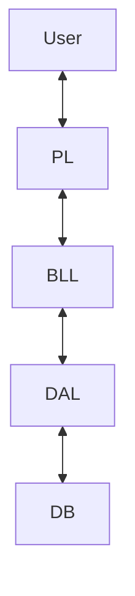

# 🚗 DVLD - Driving & Vehicle License Department System


**Enterprise-grade desktop management system for drivers, licenses, tests, and applications.**

---

## 🏆 About This Project

**Course 19 Capstone Project | Largest Solo Implementation**

DVLD (Driving & Vehicle License Department) is a full-scale desktop system developed as the final capstone of the Backend Engineering Roadmap.

This project goes far beyond basic CRUD. It simulates real government workflows with complex dependencies, strict business rules, multi-stage processes, and role-based security.

### Key Metrics
- **Scale:** 30+ Forms, 50+ Stored Procedures/Queries
- **Architecture:** Strict 3-Tier (PL, BLL, DAL)
- **Role:** Solo Full-Stack Developer

---

## 🌟 Key Features

### 👥 People & User Management
- Full CRUD for citizen records
- Role-Based Access Control (RBAC)
- Advanced searching and filtering

### 📝 Application Management
- New, Renewal, Replacement, International licenses
- Application status lifecycle
- Automatic fee calculation

### 🚘 Driver & License Management
- Local & International license issuance
- Complete driver history
- License detainment and release workflow

### 🧪 Test Management
- Mandatory test order enforcement
- Test appointment scheduling
- Result locking & validation

---

## 🏗 Architecture & Design



### Layers
**Presentation Layer:** WinForms UI  
**Business Logic Layer:** Core rules and validations  
**Data Access Layer:** ADO.NET with SQL Server  

---

## 💻 Tech Stack

| Component | Technology |
|---------|------------|
| Language | C# |
| Framework | .NET Framework 4.8 |
| UI | Windows Forms |
| Database | SQL Server |
| Data Access | ADO.NET |
| IDE | Visual Studio 2022 |

---

## 🗄 Database Schema

Key entities:
- People
- Users
- Applications
- Tests
- Licenses

The complete schema and sample data are included via `DVLD-SQL-DataBase.bak`.

---

## ⚙ Installation & Setup

### Prerequisites
- Visual Studio 2019/2022
- SQL Server (Express or Developer)
- SQL Server Management Studio (SSMS)

### Clone Repository
```bash
git clone https://github.com/mo7morad/BackEnd-Fundamentals-RoadMap.git
cd "Fundamentals/Coding/19 - Full Real Project/DVLD-Project"
```

### Restore Database
1. Open SSMS
2. Restore database from `DVLD-SQL-DataBase.bak`
3. Ensure database name is `DVLD`

### Configure Connection String
```csharp
public static string ConnectionString =
"Server=.;Database=DVLD;Integrated Security=True;";
```

### Build & Run
- Build solution
- Run with **F5**
- Login: `Admin / 1234`

---

## 🚀 Usage Guide

### Add New User
1. Add Person
2. Create User
3. Assign permissions

### Issue Local License
1. Create new application
2. Pass Vision → Written → Street tests
3. Issue license

---

## 🧪 Testing & Quality Assurance
- Manual business rule validation
- Foreign key and workflow integrity testing

---

## 🗺 Roadmap
- [ ] Export licenses to PDF/Excel
- [ ] Biometric identity simulation
- [ ] Web dashboard (ASP.NET Core)
- [ ] Dark mode UI

---

## 📄 License
MIT License — Educational & portfolio use.

---

## 📞 Contact
**Mohammed Morad**  
GitHub: **mo7morad**
