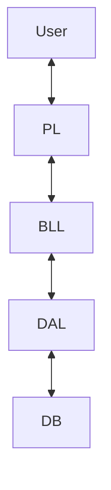

# 🚗 DVLD - Driving & Vehicle License Department System


**A massive, enterprise-grade desktop management system for managing drivers, licenses, tests, and vehicle registrations.**

---

## 🏆 About This Project

**Course 19 Capstone Project | Largest Solo Implementation**

This repository houses the source code for the **DVLD (Driving & Vehicle License Department)** system, a flagship software solution developed entirely by me as the final capstone for **Course 19** of the Backend Engineering Roadmap.

Representing the pinnacle of my procedural and architectural learning path, this project moves beyond simple CRUD applications. It simulates a complex government workflow involving multiple interconnected modules, complex business logic, state management, and a robust security layer.

### Key Metrics
- **Scale:** 30+ Forms, 50+ Stored Procedures/Queries  
- **Complexity:** Strict 3-Tier Architecture (PL, BLL, DAL)  
- **Role:** Solo Full-Stack Developer (Database, Backend, Frontend)

---

## 📑 Table of Contents
- [Key Features](#-key-features)
- [Architecture & Design](#-architecture--design)
- [Tech Stack](#-tech-stack)
- [Database Schema](#-database-schema)
- [Showcase & Screenshots](#-showcase--screenshots)
- [Installation & Setup](#-installation--setup)
- [Usage Guide](#-usage-guide)
- [Testing & Quality Assurance](#-testing--quality-assurance)
- [Roadmap](#-roadmap)
- [License](#-license)
- [Contact](#-contact)

---

## 🌟 Key Features

### 👥 People & User Management
- Full CRUD for personal data
- Role-Based Access Control (RBAC)
- Advanced searching & filtering

### 📝 Application Management
- New, Renewal, Replacement, International Licenses
- Application lifecycle tracking
- Dynamic fee calculation

### 🚘 Driver & License Management
- Local & International license issuance
- Driver history tracking
- License detainment & release logic

### 🧪 Test Management
- Vision → Written → Street test enforcement
- Appointment booking system
- Result locking & validation

---

## 🏗 Architecture & Design



**Presentation Layer (PL):** WinForms UI  
**Business Logic Layer (BLL):** Core rules & validations  
**Data Access Layer (DAL):** ADO.NET with SQL Server  

---

## 💻 Tech Stack

| Component | Technology |
|---------|------------|
| Language | C# |
| Framework | .NET Framework 4.8 |
| UI | Windows Forms |
| Database | SQL Server |
| Data Access | ADO.NET |
| IDE | Visual Studio 2022 |

---

## 🗄 Database Schema

- People  
- Users  
- Applications  
- Tests  
- Licenses  

> Full schema available via included `.bak` file.

---

## ⚙ Installation & Setup

### Prerequisites
- Visual Studio 2019/2022
- SQL Server + SSMS

### Clone Repository
```bash
git clone https://github.com/mo7morad/BackEnd-Fundamentals-RoadMap.git
```

### Restore Database
Restore `DVLD-SQL-DataBase.bak` via SSMS.

### Connection String
```csharp
public static string ConnectionString =
"Server=.;Database=DVLD;Integrated Security=True;";
```

### Run
- Build solution
- Run with **F5**
- Default login:
  - **Admin / 1234**

---

## 🚀 Usage Guide

**Add User**
1. Add Person
2. Create User
3. Assign roles

**Issue License**
1. New Application
2. Pass all tests
3. Issue License

---

## 🧪 Testing & Quality Assurance

- Manual business-rule testing
- Foreign key & workflow validation

---

## 🗺 Roadmap

- [ ] Export to PDF / Excel
- [ ] Biometric simulation
- [ ] Web dashboard
- [ ] Dark mode UI

---

## 📄 License

MIT License – Educational & portfolio use.

---

## 📞 Contact

**Mohammed Morad**  
GitHub: **mo7morad**  
LinkedIn: *Add link*
