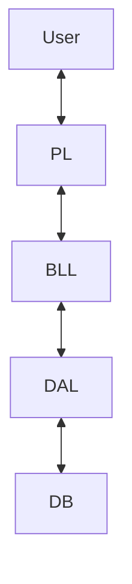

# 🚗 DVLD - Driving & Vehicle License Department System


**A massive, enterprise-grade desktop management system for managing drivers, licenses, tests, and vehicle registrations.**

---

## 🏆 About This Project

**Course 19 Capstone Project | Largest Solo Implementation**

This repository houses the source code for the **DVLD (Driving & Vehicle License Department)** system, a flagship software solution developed entirely by me as the final capstone for **Course 19** of the Backend Engineering Roadmap.

Representing the pinnacle of my procedural and architectural learning path, this project moves beyond simple CRUD applications. It simulates a complex government workflow involving multiple interconnected modules, complex business logic, state management, and a robust security layer.

### Key Metrics
- **Scale:** 30+ Forms, 50+ Stored Procedures/Queries  
- **Complexity:** Strict 3-Tier Architecture (PL, BLL, DAL)  
- **Role:** Solo Full-Stack Developer (Database, Backend, Frontend)

---

## 📑 Table of Contents
- [Key Features](#-key-features)
- [Architecture & Design](#-architecture--design)
- [Tech Stack](#-tech-stack)
- [Database Schema](#-database-schema)
- [Showcase & Screenshots](#-showcase--screenshots)
- [Installation & Setup](#-installation--setup)
- [Usage Guide](#-usage-guide)
- [Testing & Quality Assurance](#-testing--quality-assurance)
- [Roadmap](#-roadmap)
- [License](#-license)
- [Contact](#-contact)

---

## 🌟 Key Features

### 👥 People & User Management
- Full CRUD for personal data
- Role-Based Access Control (RBAC)
- Advanced searching & filtering

### 📝 Application Management
- New, Renewal, Replacement, International Licenses
- Application lifecycle tracking
- Dynamic fee calculation

### 🚘 Driver & License Management
- Local & International license issuance
- Driver history tracking
- License detainment & release logic

### 🧪 Test Management
- Vision → Written → Street test enforcement
- Appointment booking system
- Result locking & validation

---

## 🏗 Architecture & Design



**Presentation Layer (PL):** WinForms UI  
**Business Logic Layer (BLL):** Core rules & validations  
**Data Access Layer (DAL):** ADO.NET with SQL Server  

---

## 💻 Tech Stack

| Component | Technology |
|---------|------------|
| Language | C# |
| Framework | .NET Framework 4.8 |
| UI | Windows Forms |
| Database | SQL Server |
| Data Access | ADO.NET |
| IDE | Visual Studio 2022 |

---

## 🗄 Database Schema

The DVLD system is backed by a fully normalized **relational SQL Server database**, restored via the provided
`DVLD-SQL-DataBase.bak` file.

The schema is designed to enforce **data integrity, traceability, and real-world licensing constraints**.

---

### 🧩 Core Tables Overview

#### 👤 People
- Central master table for all citizens
- Stores:
  - National ID (unique)
  - Full name
  - Date of birth
  - Gender
  - Address
  - Contact information
  - Personal photo
- Referenced by Users, Drivers, and Applications

---

#### 👨‍💼 Users
- Authentication and authorization data
- Linked one-to-one with People
- Stores:
  - Username & password hash
  - Account status (active / disabled)
  - Permission flags (bitwise access control)

---

#### 📝 Applications
- Core transactional table of the system
- Represents all service requests
- Stores:
  - Application type
  - Applicant (Person / Driver)
  - Status (New, Cancelled, Completed)
  - Paid fees
  - Creation & completion dates
- Acts as the parent entity for tests and license issuance

---

#### 🧪 Tests & Test Appointments
- Manages Vision, Written, and Street tests
- Stores:
  - Test type
  - Appointment date
  - Result (Pass / Fail)
  - Examiner notes
- Business rules enforced at DB and BLL levels:
  - Test order constraints
  - One active appointment per test stage

---

#### 🚘 Licenses
- Stores all issued driving licenses
- Includes:
  - License number
  - Issue & expiration dates
  - License class
  - Status (Active, Expired, Detained)
- Supports:
  - Local licenses
  - International licenses
- Historical licenses are preserved for auditing

---

#### 🚔 Detained Licenses
- Tracks detained licenses and violations
- Stores:
  - Detainment date
  - Fine amount
  - Release status
- Prevents use of detained licenses until release

---

### 🔗 Relationships & Integrity

- Strict **foreign key constraints**
- Cascading rules prevent orphan records
- Deletions are restricted when historical data exists
- Business-critical rules enforced both:
  - In the database (constraints)
  - In the Business Logic Layer (BLL)

---

### 🧠 Stored Procedures & Queries

- 50+ stored procedures and parameterized queries
- Used for:
  - CRUD operations
  - Complex joins
  - Validation logic
- `SqlParameter` is used throughout to prevent SQL Injection


---

## ⚙ Installation & Setup

### Prerequisites
- Visual Studio 2019/2022
- SQL Server + SSMS

### Clone Repository
```bash
git clone https://github.com/mo7morad/BackEnd-Fundamentals-RoadMap.git
```

### Restore Database
Restore `DVLD-SQL-DataBase.bak` via SSMS.

### Connection String
```csharp
public static string ConnectionString =
"Server=.;Database=DVLD;Integrated Security=True;";
```

### Run
- Build solution
- Run with **F5**
- Default login:
  - **Morad / mangga**

---

## 🚀 Usage Guide

The DVLD system models real-world workflows used by a governmental driving & vehicle licensing authority.
Below are the most common operational scenarios supported by the system.

---

### 👤 People & User Management

**Register a Citizen**
1. Navigate to **People → Add Person**
2. Enter National ID, personal details, address, and photo
3. Save the person record (used system-wide)

**Create a System User**
1. Navigate to **Users → Add User**
2. Search and link an existing Person
3. Assign username, password, and permission set
4. Enable or disable account access

**Manage Permissions**
- Fine-grained permission flags (Add, Update, Delete, View)
- Access enforced across all modules at UI and business-logic levels

---

### 📝 Driving License Applications

**Create a New Application**
1. Navigate to **Applications**
2. Choose service type:
   - New Local Driving License
   - Renew License
   - Replacement (Lost / Damaged)
   - International License
3. System automatically:
   - Validates eligibility
   - Calculates required fees
   - Assigns application status

**Track Application Lifecycle**
- New → Cancelled → Completed
- Status changes are enforced by business rules

---

### 🧪 Test Management Workflow

**Schedule Tests**
1. Select an application
2. Book test appointments in strict order:
   - Vision Test
   - Written Test
   - Street Test
3. System prevents:
   - Skipping test stages
   - Booking duplicate or overlapping tests

**Record Test Results**
- Results are locked once entered
- Passed tests cannot be retaken
- Failed tests must be rescheduled

---

### 🚘 License Issuance & Management

**Issue a Local Driving License**
1. Ensure all required tests are passed
2. System enables the **Issue License** action
3. License number is generated automatically
4. Expiration date and fees are calculated

**Renew a License**
- Allowed only for expired licenses
- Renewal history is preserved

**Replace a License**
- Supports lost or damaged cases
- Original license is invalidated

---

### 🌍 International Driving License

**Issue International License**
1. Validate an active local driving license
2. Issue time-limited international permit
3. Link international license to original local license

---

### 🚔 License Detainment & Release

**Detain a License**
- Used for violations or legal reasons
- License is marked as detained and blocked from use

**Release a License**
1. Pay detainment fine
2. Release license and restore active status
3. Transaction is logged

---

### 📄 History & Auditing

- View full driver history:
  - Applications
  - Tests
  - Issued licenses
  - Detainments
- System maintains historical integrity (no silent deletes)


---


