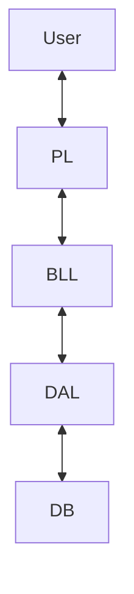

# SECTION: 10-11 - OOP-C++ 

# Courses 10 & 11: Object-Oriented Programming (OOP) in C++

This directory contains the complete source code, libraries, and capstone projects for **Course 11** of the Backend Engineering Roadmap.

This phase represents the most significant shift in my engineering journey: transitioning from **Procedural Programming** (functions and logic) to **Object-Oriented Architecture** (systems and entities). Here, I mastered the art of modeling real-world problems using Classes, Objects, and Design Patterns.

## 📂 Directory Structure
**Please Do Not Hesitate, to open and see the Detailed readme for each Project, and folder.**

The content is organized into two main categories:

### 1. 📘 [Concepts](./Concepts)
This folder contains the foundational building blocks and exercises used to master OOP theory. It includes:
* **Core Libraries:** The source code for my custom `clsString`, `clsDate`, and `clsInputValidate` libraries.
* **OOP Exercises:** Standalone files demonstrating specific concepts like:
    * **Inheritance:** `clsPerson.h` vs `clsEmployee.h`.
    * **Polymorphism:** Abstract base classes and virtual functions.
    * **Templates:** Generic programming examples.
* **Header Management:** A clean `headers/` directory structure showing how to organize dependencies professionally.

### 2. 🚀 [Projects](./Projects)
This folder contains three massive Capstone Projects that apply the concepts in real-world scenarios. Each project lives in its own subdirectory with a fully layered architecture.

#### 📇 [Project 1: Contact Management System](./Projects/ContactsSystem-Project)
A Data-Driven Application focusing on **CRUD operations**.
* **Focus:** File I/O, Data Parsing, and Search Algorithms.
* **Architecture:** Separated the "Screen" logic from the "Contact" business object.

#### 🏎️ [Project 2: Driving Simulation](./Projects/DrivingSimulation-Project)
A Logic-Driven Application focusing on **Object Interaction**.
* **Focus:** State Management, Simulation Loops, and Physics calculations.
* **Highlights:** Changing object properties (Wheels/Engine) dynamically at runtime.

#### 🏦 [Project 3: Enterprise Banking System](./Projects/OOP-BankingSystem-Project)
The Ultimate Capstone. A complete re-write of the Bank project using OOP.
* **Focus:** Enterprise Architecture, Security, and Scalability.
* **Features:** Multi-User Permissions, Currency Exchange Module, Transfer Logging, and Login Auditing.
* 
---

## 🧠 Key Topics Mastered

| Concept | Description |
| :--- | :--- |
| **Encapsulation** | Protecting data integrity using Access Specifiers (`private`, `public`, `protected`). |
| **Abstraction** | Hiding complex implementation details behind clean Interfaces (Abstract Classes). |
| **Inheritance** | Creating specialized classes (`Employee`) from generalized ones (`Person`) to maximize code reuse. |
| **Polymorphism** | Using Virtual Functions to allow objects to behave differently depending on their specific type. |
| **Templates** | Writing generic, type-safe code (e.g., `clsInputValidate<int>` vs `clsInputValidate<double>`). |

## 🛠️ How to Navigate
1.  Start with the **Concepts** folder to see the raw implementation of my libraries (`String`, `Date`).
2.  Move to **Contact Management System** to see how these libraries are used in a simple application.
3.  Finish with **Enterprise Banking System** to see a full-scale Enterprise architecture.

---
*This repository documents my journey in mastering Backend Engineering.*


---


# SECTION: 12 - DS - Level1 

# Course 12: Data Structures Level 1

This directory contains my implementations of fundamental **Data Structures** in C++, created for **Course 12** of the Backend Engineering Roadmap.

In this phase, I moved beyond standard libraries to build core data structures from scratch. This was essential for understanding memory management, pointer manipulation, and the **Big O** efficiency of different operations (Insertion, Deletion, Search).

## 📂 Topics & Implementations

The code files demonstrate the manual construction of the following structures:

### 1. 🔗 [Singly Linked List (`linkedlist.cpp`)](./linkedlist.cpp)
A dynamic chain of nodes where each node points to the next.
* **Core Operations:** `InsertFirst`, `InsertLast`, `InsertAt`, and `Delete` specific values.
* **Search & Analysis:** Implemented `IsExists` to find values and `IndexOf` to return their position.
* **Efficiency:** Learned that insertion at the *head* is $O(1)$, while insertion at the *tail* (without a tail pointer) is $O(N)$.

### 2. ⛓️ [Doubly Linked List (`doublylinkedlist.cpp`)](./doublylinkedlist.cpp)
An advanced list where nodes have pointers to both **Next** and **Previous** nodes, allowing bidirectional traversal.
* **Optimization:** Implemented smart insertion logic (`_InsertAtUsingHEAD` vs `_InsertAtUsingREAR`) to traverse from the closest end, cutting traversal time in half.
* **Memory Management:** A custom destructor `~DoublyLinkedList()` ensures all nodes are properly deleted to prevent memory leaks.
* **Flexibility:** Supports full CRUD operations including deleting the Head, Tail, or Middle nodes safely.

### 3. 📦 [Dynamic Array (`array.cpp`)](./array.cpp)
A custom Array ADT (Abstract Data Type) that overcomes the fixed-size limitation of standard arrays.
* **Dynamic Resizing:** The `Enlarge()` method allocates a new, larger block of memory and migrates existing data automatically.
* **Data Manipulation:** Supports `Append`, `Insert` (shifting elements right), and `Delete` (shifting elements left).
* **Merging:** Logic to combine two separate arrays into a single larger one.

### 4. 🗺️ [HashMap / Dictionary (`Map Example.cpp`)](./Map%20Example.cpp)
Introduction to Key-Value pair storage using the standard `std::map`.
* **Usage:** Storing Student Names (Key) and Grades (Value) for fast lookup.
* **Search:** Efficiently checking for keys using `.find()` to avoid errors when accessing non-existent data.

## 🛠️ Tech Stack
* **Language:** C++
* **Concepts:**
    * **Templates (`template <class T>`):** Used to make the Linked List classes generic (working with `int`, `string`, etc.).
    * **Pointers:** Heavy use of raw pointers (`Node* next`, `Node* prev`) for manual memory linking.
    * **Memory Management:** Manual `new` and `delete` operations.

## 🚀 How to Run

To test the Doubly Linked List implementation:

1.  **Compile:**
    ```bash
    g++ doublylinkedlist.cpp -o DLLApp
    ```
2.  **Run:**
    ```bash
    ./DLLApp
    ```

## 📝 Key Takeaways
* **Memory Anatomy:** I now visualize data not just as variables, but as blocks of memory linked by addresses.
* **Trade-offs:** Learned why an **Array** is better for access ($O(1)$) but a **Linked List** is better for insertion/deletion ($O(1)$ at known positions).
* **Generic Programming:** Mastering C++ Templates allowed me to write a single Data Structure class that works for any data type.

---
*This repository documents my journey in mastering Backend Engineering.*


---


# SECTION: 14 - C# - WinForms 

# Course 14: Introduction to C# & .NET Framework

This directory contains my notes, exercises, and capstone projects for **Course 14** of the Backend Engineering Roadmap.

This course marked my official transition from C++ to **C# and the .NET Ecosystem**. I learned the architecture of the **CLR (Common Language Runtime)**, mastered C# syntax (LINQ, Delegates, Properties), and built my first GUI-based desktop applications using **Windows Forms**.

## 📂 Topics Covered

The course moved from console-based logic to visual event-driven programming:

### 1. 🏗️ The .NET Architecture
* **CLR Internals:** Understanding how the Common Language Runtime manages memory (Garbage Collection) and executes code (JIT Compilation).
* **Managed vs. Unmanaged Code:** The difference between code running under the CLR and raw machine code (like C++).
* **CTS & CLS:** How .NET ensures interoperability between languages (C#, F#, VB).

### 2. 💻 C# Fundamentals
* **Syntax & Types:** `var` (implicit typing), Nullable types (`int?`), and Dynamic types.
* **Collections & LINQ:** Using System.Linq for powerful array operations (`Sum`, `Count`, `Average`) instead of manual loops.
* **String Manipulation:** String Interpolation (`$"{Name}"`) and standard library methods.

### 3. 🖥️ Windows Forms (GUI)
* **Controls:** Mastered the standard toolbox: `TextBox`, `ComboBox`, `CheckBox`, `RadioButton`, `DateTimePicker`, `TreeView`, and `ListView`.
* **Events:** Handling user interactions like `Click`, `TextChanged`, and `MouseHover`.
* **Containers:** Using `GroupBox`, `Panel`, and `TabControl` to organize complex layouts.
* **Dialogs:** Implementing file handling with `OpenFileDialog` and `SaveFileDialog`.

---

## 🏆 Capstone Projects

To apply these concepts, I built two interactive Desktop Applications.

### 1. 🍕 [Pizza Order System](./Projects/Pizza-Shop)
A complete Point-of-Sale (POS) dashboard for a pizza shop.
* **Dynamic Pricing:** Real-time price updates as the user selects sizes, crust types, and toppings.
* **Event Handling:** Heavy use of `CheckedChanged` events to toggle options logic.
* **UI Design:** Organized using GroupBoxes to separate "Size", "Toppings", and "Order Summary".

### 2. ❌⭕ [Tic-Tac-Toe Game](./Projects/Tic-Tac-Toe)
A graphical implementation of the classic game.
* **Game Logic:** Checks for win conditions (Rows, Columns, Diagonals) after every move.
* **Visual Feedback:** Paints the winning line and freezes the board upon victory.
* **Turn Management:** Switches between Player X and Player O automatically.

---

## 🛠️ Tech Stack
* **Language:** C#
* **Framework:** .NET Framework (Windows Forms)
* **IDE:** Visual Studio
* **Key Concepts:** Event-Driven Programming, Object-Oriented UI Design.

---
*This repository documents my journey in mastering Backend Engineering.*


---


# SECTION: 18 - DB Connectivity 

# Course 18: C# & Database Connectivity (ADO.NET)

This directory contains my projects, exercises, and architectural patterns for **Course 18** of the Backend Engineering Roadmap.

In this phase, I learned how to connect C# applications to SQL Server using **ADO.NET**. I moved beyond writing simple queries to building a robust **3-Tier Architecture** that separates Data Access, Business Logic, and the User Interface.

## 📂 Topics Covered

The course focused on three main pillars of backend development:

### 1. 🔌 ADO.NET Fundamentals
* **Connection:** Establishing secure connections to SQL Server using `SqlConnection`.
* **CRUD Operations:**
    * **Create:** Inserting records and retrieving the new Auto-ID (`SCOPE_IDENTITY()`).
    * **Read:** Fetching data using `SqlDataReader` for performance vs `DataTable` for flexibility.
    * **Update/Delete:** Executing parameterized commands to prevent SQL Injection.
* **Disconnected Mode:** Using `SqlDataAdapter` and `DataSet` to work with data offline and sync changes later.

### 2. 🏗️ 3-Tier Architecture
I refactored my monolithic code into three distinct layers to ensure maintainability and scalability:
* **Presentation Layer (PL):** The UI (Console or WinForms) that interacts with the user.
* **Business Logic Layer (BLL):** Validates data (e.g., "Is this email valid?") before passing it to the database.
* **Data Access Layer (DAL):** The only layer that talks to the database. It executes queries and returns generic data structures.

### 3. 🧠 In-Memory Data Structures
* **DataTable:** A memory representation of a single SQL table.
* **DataView:** A filtered/sorted view of a DataTable (like a virtual SQL View but in RAM).
* **DataSet:** A collection of DataTables with relationships, simulating a mini-database in memory.

---

## 🏆 Capstone Project: Contacts Manager (3-Tier)

I built a complete **Contacts Management System** that allows users to manage a directory of people (Names, Emails, Phones, Countries). I implemented this twice to prove that the **Business and Data layers** are reusable across different interfaces.

### 🏛️ System Architecture

| Layer | Responsibility | Example Class |
| :--- | :--- | :--- |
| **Presentation** | User Input & Output (Console/Forms) | `frmAddContact.cs` |
| **Business Logic** | Validation & Rules | `clsContact.cs` |
| **Data Access** | SQL Commands & Connections | `clsContactDataAccess.cs` |

### 🚀 Implementation 1: Console App
A command-line interface to interact with the system.
* **Focus:** Understanding the logic flow without UI distractions.
* **Key Feature:** Creating a generic "DTO" (Data Transfer Object) to pass data between layers.

### 🚀 Implementation 2: Windows Forms App
A GUI-based version reusing the *exact same* Business and Data layers from the Console App.
* **Data Binding:** Linking `DataGridView` directly to `DataTables` returned from the BLL.
* **Event Handling:** Using events to trigger database updates (e.g., clicking "Save").

---

## 🛠️ Technical Highlights

### 🔒 Parameterized Queries
Instead of string concatenation (which is dangerous), I used `SqlParameter` to safely handle user input and avoid SQL injections:
```csharp
SqlCommand command = new SqlCommand("SELECT * FROM Contacts WHERE Name = @Name", connection);
command.Parameters.AddWithValue("@Name", txtName.Text);


---


# SECTION: 20 - C# - Level 02 

# Course 20: Advanced C# Programming & Architecture

This directory contains the advanced concepts, architectural patterns, and custom controls developed for **Course 20** of the Backend Engineering Roadmap.

In this phase, I transitioned from writing working code to writing **professional, scalable, and decoupled code**. I mastered the advanced features of the .NET ecosystem, including **Asynchronous Programming**, **Reflection**, **Cryptography**, and **Custom User Controls**.

## 📂 Topics & Architectures

The course covers five major pillars of advanced C# development:

### 1. 📢 Events, Delegates & Lambdas
The foundation of decoupled architecture.
* **Delegates:** passing methods as parameters using `Func`, `Action`, and `Predicate`.
* **Events:** Implementing the **Publisher/Subscriber** pattern (e.g., News Publisher, Temperature Monitor).
* **Lambdas:** Writing concise, inline code blocks to replace verbose delegate definitions.
* **Form Communication:** Sending data between WinForms loosely coupled using Delegates instead of direct object references.

### 2. ⚡ Concurrency & Asynchronous Programming
Building responsive and high-performance applications.
* **Multithreading:** Managing the `Thread` class, handling **Race Conditions**, and using Synchronization (Locks).
* **TPL (Task Parallel Library):** Moving to the modern `Task` based pattern.
* **Async/Await:** Writing non-blocking I/O code to keep the UI responsive.
* **Parallel Class:** Using `Parallel.For` and `Parallel.ForEach` to utilize multi-core processors for data processing.

### 3. 🔐 Security & Cryptography
Implementing industry-standard security measures.
* **Hashing:** One-way data masking using SHA256 (for passwords).
* **Symmetric Encryption:** Encrypting data with a shared key (AES).
* **Asymmetric Encryption:** Secure communication using Public/Private key pairs (RSA).

### 4. 🧰 Advanced .NET Internals
* **Reflection:** Inspecting assembly metadata at runtime to dynamically create objects or invoke methods.
* **Attributes:** Creating custom metadata tags (`[Validation]`) to enforce rules or control serialization.
* **Serialization:** Converting objects to **XML**, **JSON**, and **Binary** for storage or transmission.
* **Generics:** Writing type-safe, reusable code structures.

### 5. 🖥️ System Interaction & Logging
* **Windows Registry:** Reading and writing configuration data to the OS registry.
* **Event Log:** Logging application errors and info to the Windows Event Viewer.
* **App.config:** Managing application settings securely.

---

## 🏆 Applications

To apply these concepts, I built several complex UI components and Logic Systems.

### 1. 🚦 Traffic Light Control (User Control)
A reusable visual component encapsulating the logic of a traffic signal.
* **Features:** Configurable timer, automatic state switching (Red -> Yellow -> Green), and custom events triggers when the light changes.

### 2. 🎱 Pool Club Management System
A graphical interface for managing pool tables.
* **User Control:** Each "Table" is a self-contained control with its own timer, hourly rate calculation, and status (Available/Busy).
* **Architecture:** The main form manages a collection of these controls dynamically.

### 3. 📨 Logger & News System
A demonstration of the Observer Pattern.
* **News Publisher:** An object that broadcasts events.
* **Subscribers:** Multiple distinct classes (EmailService, SMSService) that react to the same event differently.

---

## 🛠️ Technical Highlights

### ⚡ Async/Await Pattern
Refactoring blocking code to asynchronous tasks:
```csharp
// Old Way (Freezes UI)
void DownloadData() { 
    client.DownloadFile(url, path); 
}

// New Way (Responsive UI)
async Task DownloadDataAsync() { 
    await Task.Run(() => client.DownloadFile(url, path)); 
}


---


# SECTION: 22 - DS - Level 02 

# Course 22: Advanced Data Structures & Collections in C#

This directory contains my code examples, custom implementations, and performance comparisons for **Course 22** of the Backend Engineering Roadmap.

In this phase, I transitioned from manual data structure implementation (C++) to mastering the **.NET Collections Framework**. I learned to select the right tool for the job—understanding the trade-offs between `List`, `LinkedList`, `Dictionary`, and `HashSet`—and how to leverage **LINQ** for powerful data manipulation.

## 📂 Topics Covered

The course covers the full spectrum of C# data handling, from basic arrays to complex graph algorithms.

### 1. 📦 Standard Collections (Generics)
Replacing legacy collections with type-safe Generic collections.
* **`List<T>` vs `ArrayList`:** Understanding why `List<T>` is superior (no boxing/unboxing performance penalty).
* **`Dictionary<K,V>` vs `Hashtable`:** Mastering key-value lookups with $O(1)$ complexity.
* **`LinkedList<T>`:** Using the built-in doubly linked list for $O(1)$ insertions/deletions.
* **`Stack<T>` & `Queue<T>`:** Standard LIFO and FIFO implementations.

### 2. 🔢 Set Theory & Hashing
Handling unique data efficiently.
* **`HashSet<T>`:** High-performance unique collections.
* **Set Operations:** Implementing Mathematical Logic using C#:
    * **Union:** `UnionWith()`
    * **Intersection:** `IntersectWith()`
    * **Difference:** `ExceptWith()`
    * **Symmetric Difference:** `SymmetricExceptWith()`
* **Sorted Sets:** Using `SortedSet<T>` and `SortedList<K,V>` for auto-sorting data upon insertion.

### 3. 🌲 Non-Linear Data Structures
Since C# doesn't have built-in classes for these, I implemented them from scratch to understand the architecture:
* **Trees:**
    * **General Trees:** Nodes with $N$ children.
    * **Binary Trees:** Traversals (Pre-order, In-order, Post-order).
* **Heaps:**
    * **Min-Heap & Max-Heap:** Implementation for Priority Queues.
* **Graphs:**
    * **Representations:** Adjacency Matrix vs. Adjacency List.
    * **Traversals:** BFS (Breadth-First Search) and DFS (Depth-First Search).

### 4. 🧠 Advanced C# Features
* **Tuples:** Storing lightweight data groups without creating classes.
* **BitArray:** managing arrays of booleans compactly.
* **ObservableCollection:** Collections that notify the UI when items are added/removed (crucial for WPF/MAUI apps).
* **Jagged Arrays:** Creating arrays of arrays (matrices).

### 5. 🏗️ Collection Interfaces
Understanding the hierarchy that powers LINQ.
* **`IEnumerable<T>`:** The base interface that allows `foreach` loops.
* **`ICollection<T>`:** Adds `Add`, `Remove`, and `Count`.
* **`IList<T>`:** Adds indexer access `[i]`.
* **`IComparable`:** Implementing custom sorting logic for objects.

## 🏆 Key Implementations

This repository includes my custom C# implementations for structures not found in the standard library:

### 1. 🌳 Binary Tree
A fully functional Binary Tree class supporting:
* **Insertion:** Auto-balancing logic.
* **Traversal:** Methods to print tree contents in sorted order 3 types.

### 2. 🕸️ Graph System
A flexible Graph class supporting:
* **Vertex/Edge Management:** Adding nodes and connecting them.
* **Adjacency Logic:** Efficiently finding neighbors of a node.

## 🛠️ Tech Stack
* **Language:** C#
* **Framework:** .NET Core / .NET Framework
* **Concepts:** Generics, Boxing/Unboxing, Complexity Analysis (Big O).

---
*This repository documents my journey in mastering Backend Engineering.*


---


# SECTION: 25 - APIs 

# Course 25: Web APIs & RESTful Architecture

This directory contains my explorations, exercises, and full-stack projects for **Course 25** of the Backend Engineering Roadmap.

In this phase, I transitioned from building standalone desktop apps to building **Distributed Systems**. I started by exploring low-level **Win32 APIs** to control the Operating System, then moved to building modern **RESTful Web APIs** using ASP.NET Core. I learned to structure endpoints, handle HTTP verbs, and connect these APIs to the Database architectures I built in previous courses.

## 📂 Topics Covered

The course is divided into three distinct phases of API understanding:

### 1. 🖥️ Desktop & Win32 APIs
Before touching the web, I learned what an API truly is by interacting with Windows itself using `[DllImport]`.
* **System Control:** Changing desktop wallpapers, shutting down the PC, and reading battery levels programmatically.
* **Office Automation:** Controlling Word, Excel, and Outlook (sending emails) via code.
* **Process Management:** Listing and managing running Windows processes.

### 2. 🌐 Web & REST Fundamentals
Understanding the language of the web (HTTP).
* **Data Formats:** XML vs. **JSON** (the standard for modern APIs).
* **HTTP Verbs:** `GET` (Read), `POST` (Create), `PUT` (Update), `DELETE` (Remove).
* **Status Codes:** Understanding the difference between `200 OK`, `201 Created`, `400 Bad Request`, `404 Not Found`, and `500 Server Error`.
* **DTOs (Data Transfer Objects):** Learning to decouple the Database Schema (Models) from the API Response to ensure security and flexibility.

### 3. 🏗️ ASP.NET Core Web API
Building the actual services.
* **Routing:** How URLs (`/api/students/1`) map to C# Controller methods.
* **Model Binding:** Automatically mapping JSON request bodies to C# objects.
* **Media Handling:** Endpoints for uploading and serving images files.

---

## 🏆 Projects & Architecture

This repository is organized into specific folders reflecting the evolution of my API skills.

### 1. ⚙️ [Win32_System_Integrations](./Win32_APIs)
A collection of Console Applications utilizing unmanaged code.
* **WallpaperChanger:** Uses `user32.dll` to set the desktop background.
* **SystemInfo:** Retrieval of screen resolution and power status.
* **OfficeInterop:** Scripts to generate reports in Excel and send them via Outlook.

### 2. 🎓 [StudentAPI_InMemory (v1 - v7)](./StudentAPI_InMemory)
My first RESTful API. To focus purely on HTTP logic, this version uses a **static in-memory list** instead of a database.
* **Evolution:**
    * **v1:** `GET /api/students` - Returns all students.
    * **v2-v4:** Added filtering (`/passed`, `/avg`) and path parameters (`/{id}`).
    * **v5:** `POST` - Implementing creation logic with `201 Created` responses.
    * **v6-v7:** `DELETE` and `PUT` - Completing the CRUD cycle.
* **Client App:** A C# Console Application using `HttpClient` to consume these endpoints, proving that the client is decoupled from the server.

### 3. 🗄️ [StudentAPI_Database (3-Tier)](./StudentAPI_Database)
**The Capstone Project.**
I refactored the In-Memory API to connect to a real **SQL Server Database**, reusing the **3-Tier Architecture** (Business Logic & Data Access Layers) from Course 18.
* **Architecture:**
    * **Controller:** Handles HTTP Requests and DTO mapping.
    * **Business Layer:** Validates logic (e.g., "Student age must be > 18").
    * **Data Layer:** Executes ADO.NET commands to SQL Server.
* **Features:** Full CRUD with persistent storage.

### 4. 🖼️ [Media_Server](./Media_Server)
A specialized API project for file management.
* **Upload:** `POST /api/files/upload` accepts `IFormFile` to save images to the server's disk.
* **Retrieve:** `GET /api/files/{filename}` streams image data back to the client.

---

## 🛠️ Technical Highlights

### 🔁 DTO Implementation
Instead of returning the raw `Student` DB Entity, I implemented DTOs to control what data is exposed:
```csharp
// Raw Entity (Hidden)
public class Student {
    public int ID { get; set; }
    public string Name { get; set; }
    public string PasswordHash { get; set; } // Never expose this!
}

// DTO (Exposed)
public class StudentDTO {
    public string FullName { get; set; }
    public double AverageGrade { get; set; }
}


---


# SECTION: 26 - SOLID 

# Course 26: SOLID Principles & Clean Architecture

This directory contains my refactoring exercises and architectural examples for **Course 26** of the Backend Engineering Roadmap.

In this phase, I focused on **Software Architecture**. I learned that writing code is easy, but writing code that survives change is hard. I mastered the **SOLID Principles** to build systems that are easy to maintain, test, and extend without breaking existing functionality.

## 📂 Topics & Principles

The course is structured around the five pillars of OOD (Object-Oriented Design), plus the Dependency Injection pattern.

### 1. 🟢 Single Responsibility Principle (SRP)
*"A class should have one, and only one, reason to change."*
* **The Problem:** A `UserService` class that handles User Logic AND Email Notification AND Error Logging.
* **The Solution:** Splitting this into `UserService`, `EmailService`, and `LoggerService`.
* **Projects:**
    * **Logging Service:** Refactored a monolithic logger into specific responsibilities.
    * **Notification Service:** Separated message formatting from the actual sending logic.

### 2. 🔵 Open/Closed Principle (OCP)
*"Software entities should be open for extension, but closed for modification."*
* **The Problem:** Modifying a `PaymentProcessor` class with `if/else` statements every time a new payment method (PayPal, Crypto) is added.
* **The Solution:** Using **Polymorphism** and **Abstract Classes**. I can now add a `CryptoPayment` class without touching the core processor code.
* **Projects:**
    * **Payment Service:** Implemented a plugin-style architecture where new payment types are added as new classes.

### 3. 🟡 Liskov Substitution Principle (LSP)
*"Subtypes must be substitutable for their base types."*
* **The Problem:** The classic "Ostrich" problem. If `Bird` has a `Fly()` method, and `Ostrich` inherits from `Bird` but throws an exception when `Fly()` is called, it violates LSP.
* **The Solution:** Segregating inheritance hierarchies based on behavior (e.g., `FlyingBird` vs. `FlightlessBird`) rather than just biological classification.
* **Projects:**
    * **Vehicle System:** Ensuring that derived classes (like `Bicycle`) don't break the contract of base classes (like `EngineVehicle`).

### 4. 🟣 Interface Segregation Principle (ISP)
*"Clients should not be forced to depend on methods they do not use."*
* **The Problem:** A "Fat Interface" like `IMultiFunctionDevice` that forces a simple Printer to implement `Scan()` and `Fax()`, throwing "Not Implemented" exceptions.
* **The Solution:** Splitting large interfaces into smaller, specific ones (`IPrinter`, `IScanner`, `IFax`).
* **Projects:**
    * **Printer System:** Refactoring a monolithic interface into granular ones so devices implement only what they actually do.

### 5. 🔴 Dependency Inversion Principle (DIP)
*"High-level modules should not depend on low-level modules. Both should depend on abstractions."*
* **The Problem:** A `ReportGenerator` class that instantiates a specific `SQLDatabase` class inside its constructor. Tightly coupled!
* **The Solution:** Depending on an interface `IDatabase`. The `ReportGenerator` doesn't care if the data comes from SQL, Oracle, or a Text File.
* **Projects:**
    * **Report System:** A flexible reporting engine that can switch data sources without changing the report logic.

---

## 🏗️ Architectural Patterns

### 💉 Dependency Injection (DI)
The practical application of the Dependency Inversion Principle.
* **Concept:** Instead of a class creating its dependencies (`new Service()`), they are "injected" into it (usually via the constructor).
* **Benefit:** Makes unit testing incredibly easy because real services can be swapped for mocks.

---

## 📂 Directory Structure
There is 3 Folders, 2 diffreent courses, and one to apply on what I've learned
Each folder contains a "Before" (Violating) and "After" (Refactored) version of the code to demonstrate the principle in action.

* **`01_SRP/`** - Notification & Logging examples.
* **`02_OCP/`** - Payment Gateway extension examples.
* **`03_LSP/`** - Bird & Vehicle hierarchy fixes.
* **`04_ISP/`** - Printer & Device interface segregation.
* **`05_DIP/`** - Report generation decoupling.

## 🛠️ Tech Stack
* **Language:** C# (.NET Core)
* **Concepts:** Abstract Classes, Interfaces, Polymorphism, DI Containers.

## 🚀 How to Run
These are Console Applications designed to demonstrate logic.

1.  Navigate to a specific principle folder (e.g., `26 - SOLID/02_OCP`).
2.  Run the project:
    ```bash
    dotnet run
    ```

---
*This repository documents my journey in mastering Backend Engineering.*


---


# SECTION: ATM-System-Upgrade 

# 🛡️ Bank System V3: Security & User Management

**A multi-user banking environment with role-based access control (RBAC), user management, and secure authentication.**

This project expands the previous Banking System by introducing a **Security Layer**. It shifts from a single-admin view to a multi-user system where Admins can manage Tellers, and permissions control who can do what.

## 📸 Project Demo

Here is a walkthrough of the security features:

### 1. Secure Authentication
The system now requires a valid Username and Password to enter. It authenticates against the `Users.txt` database.


### 2. User-Specific Dashboard
Once logged in, the Main Menu personalizes the header (e.g., "Logged as: Morad").


### 3. Role-Based Access Control (RBAC)
If a user tries to access a feature they don't have permission for (like "Manage Users"), the system blocks them with an "Access Denied" message.


### 4. User Management Module
Admins with full privileges can access the "Manage Users" screen to List, Add, Update, or Delete system users.


### 5. Permissions System
Users are assigned permissions using a **Bitwise** system (e.g., `-1` for Full Access, `3` for List+Add).


## ✨ Key Features

* **Bitwise Permissions:** Efficiently stores complex access rights (Show, Add, Delete, Update, Transactions, Manage Users) in a single integer.
* **Audit Trail:** (Optional extension) The architecture supports logging user activity to track who performed specific actions.
* **Admin Tools:** Full CRUD capabilities for managing the internal staff (Users) separate from the Bank Clients.
* **Persistent Security:** User credentials and permission bits are stored securely in `Users.txt`.

## 🛠️ Technical Highlights

* **Bitwise Operations:** Used `&` (AND) and `|` (OR) operators to check and set permissions.
    * Example: `if (User.Permissions & pTransactions)` checks if the user has the Transaction bit set.
* **Separation of Concerns:** The `User` logic is strictly separated from `Client` logic, ensuring the security layer doesn't interfere with banking operations.

## 🚀 How to Run

1.  **Compile:**
    ```bash
    g++ ProjectContinuation-BankExtension2.cpp -o BankSecurity
    ```
2.  **Run:**
    ```bash
    ./BankSecurity
    ```
    *Default Admin Credentials:* `User: Admin`, `Pass: 1234`


---


# SECTION: ATM-System 

# 🏧 ATM System Console App

**A client-facing simulation of an Automated Teller Machine (ATM) interface.**

Unlike the Bank Admin system, this application is designed for the **Bank Clients**. It allows them to log in with their Account Number and PIN to perform quick transactions and check their balances.

## ✨ Features

* **Quick Withdraw:** A fast-action menu with predefined cash denominations ($20, $50, $100, $200, $400, $600, $800, $1000).
* **Normal Withdraw:** Allows entering a custom amount (must be a multiple of 5).
* **Deposit:** Adds funds securely to the user's account.
* **Balance Check:** Real-time query of the `Clients.txt` database to show available funds.
* **Shared Database:** Seamlessly integrates with the Bank Admin system by reading/writing to the same `Clients.txt` file.

## 🛠️ Technical Highlights

* **Client Authentication:** Validates `AccountNumber` and `PinCode` against the database before granting access.
* **Input Validation:** Ensures withdrawal amounts do not exceed the current balance.
* **Reusable Logic:** Reuses the core file parsing logic (`LoadClientsDataFromFile`, `SaveClientsDataToFile`) from the main banking project.

## 🚀 How to Run

1.  **Compile:**
    ```bash
    g++ ATM-System-Project.cpp -o ATMApp
    ```
2.  **Run:**
    ```bash
    ./ATMApp
    ```
    *Test Credentials (from clients.txt):* `Account: A155`, `Pin: 83928`


---


# SECTION: BankingSystem-Project 

# 🏦 Console Banking System (Procedural C++)

**A robust console-based banking application capable of managing clients, processing transactions, and persisting data to the hard drive.**

This project represents the culmination of my **Algorithm & Problem Solving Level 3** course. It moves beyond simple algorithms to build a complete software system with a flat-file database backend.

## 📸 Project Demo

Here is a walkthrough of the system's core features:

### 1. Main Dashboard
The application separates administrative tasks (Client Management) from financial operations (Transactions) via a clean menu system.


### 2. Client Management (CRUD)
The system allows adding new clients with automatic duplicate detection (preventing two clients from having the same Account Number). It also supports updating, deleting, and finding client records.


### 3. Reporting & Visualization
Administrators can generate formatted reports of all active clients, showing personal details and current balances in a structured table.


### 4. Financial Transactions
A dedicated transaction menu handles Deposits and Withdrawals. The system updates the "Database" file in real-time, ensuring balances are accurate immediately after a transaction.


## ✨ Features

* **Persistent Storage:** All data (Clients, Balances) is saved to `ClientsData.txt`. The system loads this data on startup and saves changes instantly.
* **CRUD Operations:** Full capability to Create, Read, Update, and Delete client records.
* **Transaction Logic:**
    * **Deposit:** Adds funds to a specific account.
    * **Withdraw:** Checks for sufficient funds before deducting.
    * **Total Balances:** Calculates the sum of all money held in the bank.
* **Search Engine:** Efficiently finds clients by Account Number using linear search.

## 🛠️ Technical Highlights

* **File I/O (`fstream`):** Implements a custom parser to convert between C++ Structures and text-based records (e.g., `A101#//#Pin#//#Name...`).
* **Modular Architecture:** The code is split into logical functions (`ShowMainMenu`, `ShowTransactionsMenu`, `LoadDataFromFile`) to maintain readability.
* **Data Structures:** Uses `vector<sClient>` to manage the list of clients dynamically in memory.
* **Input Validation:** Ensures the user enters valid menu choices and numeric values for transactions.

## 🚀 How to Run

1.  **Compile the code:**
    ```bash
    g++ BankSystem.cpp -o BankApp
    ```
2.  **Run the executable:**
    ```bash
    ./BankApp
    ```
    *(Note: Ensure you have write permissions in the folder so the program can create/update `ClientsData.txt`)*


---


# SECTION: Basics-C++ 

# Course 03: C++ Basics Structured Programming & Data Organization


While the 2nd course focused on syntax and basic logic, this course shifted focus to **organizing code and data**. I learned how to build custom data types using **Structures** and **Enums**, how to break large programs into reusable **Functions**, and how to handle complex logic with **Nested Loops**.

## 📂 Project Structure & Topics Covered

The code files in this directory are categorized by the concepts they demonstrate:

### 1. 🏗️ Data Structures (Structs & Enums)
Moving beyond basic types (`int`, `string`) to model real-world entities.
* **`structures&Enums.cpp`:**
    * Created complex custom types (e.g., `stPerson`, `stContactInfo`).
    * Implemented **Nested Structures** (e.g., an Address struct inside a ContactInfo struct).
    * Used **Enums** to define specific states (Gender, Marital Status, Colors) for code readability.
* **`Arrays_of_structures.cpp`:**
    * Combined Arrays with Structures to create a simple "Database" system.
    * Managed a list of users (e.g., reading and printing data for up to 100 persons).

### 2. 🧩 Functions & Modularity
Learning to write clean, reusable code.
* **`functions.cpp`:**
    * Difference between `void` procedures and functions with `return` values.
    * Designing reusable logic blocks (e.g., a function to calculate sums or print banners).
* **`Enums_Functions.cpp`:**
    * Combining Enums with Switch-Case statements to create interactive menus (e.g., Weekday selector, Color picker).

### 3. 🔄 Advanced Control Flow
* **`Nested_Loops.cpp`:**
    * Mastered the logic of loops inside loops.
    * Solved pattern printing problems (Star triangles, Number pyramids, Letter combinations `AA` to `ZZ`).
* **`relational_oprators.cpp`:** Deep dive into comparison logic (`==`, `!=`, `>=`, etc.).

### 4. 🧠 Problem Solving Collection
* **`problem_solving.cpp`:** A compilation of various algorithms solved using the new concepts:
    * **Validation:** Ensuring user input (like Age) falls within a valid range.
    * **Geometry:** Calculating Rectangle areas using advanced math (`sqrt`).
    * **Logic:** Checking for Odd/Even numbers, Pass/Fail status.
    * **Time Calculation:** Converting total seconds into Days:Hours:Minutes format.

## 🛠️ Tech Stack
* **Language:** C++
* **Key Concepts:**
    * `struct` (Data Grouping)
    * `enum` (State Management)
    * Functions & Procedures
    * Nested `for` Loops
    * Arrays of Structures

## 🚀 How to Run
To run any of these files, use a standard C++ compiler:

1.  **Compile:**
    ```bash
    g++ structures&Enums.cpp -o myProgram
    ```
2.  **Run:**
    ```bash
    ./myProgram
    ```

## 📝 Key Takeaways
* **Data Modeling:** I can now represent complex real-world data (like a User Profile) using `structs` instead of loose variables.
* **Code Reusability:** I learned to never repeat code. If logic is used twice, it belongs in a function.
* **Readability:** Using `Enums` (e.g., `Color::Red` instead of `1`) makes the code self-documenting.
* **Complex Logic:** Nested loops gave me a deeper understanding of iteration and algorithm complexity.

---
*This repository documents my journey in mastering Backend Engineering.*


---


# SECTION: C# - FunctionalProgramming - LINQ 

# Course: C# Functional Programming & LINQ

This directory contains my deep dive into **Functional Programming** concepts in C# and the **LINQ (Language Integrated Query)** architecture.

In this phase, I refactored my coding mindset. I learned to replace verbose `foreach` loops with concise, readable, and expressive LINQ queries. I mastered the underlying mechanisms of LINQ—Delegates, Extension Methods, and the `IEnumerable<T>` interface—to write cleaner and more maintainable code.

## 📂 Topics Covered

The course is structured to build the LINQ engine from the ground up before using it.

### 1. 🏗️ The Foundations (Functional C#)
Understanding the building blocks that make LINQ possible.
* **Delegates:** Using `Func<T, TResult>`, `Action<T>`, and `Predicate<T>` to pass functions as variables.
* **Lambda Expressions:** Writing anonymous functions using the concise `=>` syntax.
* **Extension Methods:** How to "add" methods to existing types (like adding `.Filter()` to `List<T>`) without modifying the source code.
* **Anonymous Types:** Creating temporary data structures (`new { Name = "Ali", Age = 20 }`) on the fly.

### 2. ⚙️ LINQ Architecture
* **`IEnumerable<T>` & `IEnumerator`:** The standard mechanism for iterating over collections.
* **Yield Return:** Creating stateful iterators using the `yield` keyword.
* **Deferred vs. Immediate Execution:** Understanding why a query doesn't run until you loop over it (Deferred) vs. creating a list immediately (`.ToList()`).

### 3. 🔍 LINQ Operators (The Toolkit)
I mastered the standard query operators for manipulating data collections:
* **Filtering:** `Where()`, `OfType<T>()`.
* **Projection:** `Select()` (Transformation), `SelectMany()` (Flattening lists of lists).
* **Sorting:** `OrderBy()`, `OrderByDescending()`, `ThenBy()`.
* **Grouping:** `GroupBy()` to categorize data (e.g., Group Students by Class).
* **Set Operations:** `Distinct()`, `Union()`, `Intersect()`, `Except()`.
* **Quantifiers:** `Any()`, `All()`, `Contains()`.
* **Aggregation:** `Count()`, `Sum()`, `Min()`, `Max()`, `Average()`, `Aggregate()`.
* **Partitioning:** `Take()`, `Skip()`, `TakeWhile()`, `SkipWhile()` (Pagination logic).
* **Element Operators:** `First()`, `FirstOrDefault()`, `Single()`, `Last()`.

### 4. 📝 Syntax Styles
* **Method Syntax (Fluent API):** Chaining methods (`list.Where(x => x > 5).Select(x => x * 2)`).
* **Query Syntax:** SQL-like structure (`from x in list where x > 5 select x * 2`).

---

## 🏆 Key Implementations & Examples

This repository contains varied data analysis examples demonstrating the power of LINQ.

### 1. 📊 Data Analysis System
A project analyzing complex lists of `Product` and `Customer` objects.
* **Scenario:** "Find top 5 most expensive products that are currently in stock."
* **Code:**
    ```csharp
    var topProducts = products
        .Where(p => p.Stock > 0)
        .OrderByDescending(p => p.Price)
        .Take(5)
        .Select(p => new { p.Name, p.Price }); // Projection to Anonymous Type
    ```

### 2. 🔄 Dynamic Filtering Engine
Using functional patterns to build filters dynamically.
* **Scenario:** Filtering a user list based on multiple optional criteria (Age, Country, ActiveStatus) without writing nested `if` statements.

### 3. 🧬 Set Operations
Comparison logic between two data sources.
* **Scenario:** Finding "New Customers" by comparing today's customer list with yesterday's list using `Except()`.

## 🛠️ Tech Stack
* **Language:** C#
* **Core Concepts:** Functional Programming, Immutability, Pure Functions, Deferred Execution.
* **Libraries:** `System.Linq`.

## 🚀 How to Run
These are Console Applications designed to demonstrate logic and output analysis results.

1.  Navigate to the specific folder (e.g., `Linq_Examples`).
2.  Run the project:
    ```bash
    dotnet run
    ```

---
*This repository documents my journey in mastering Backend Engineering.*


---


# SECTION: C++ - Level 02 

# Course 06: Introduction to Programming Level 2 (C++ Topics)

This directory contains my solutions and practice code for **Course 06** of the Backend Engineering Roadmap.

This course marked a shift from writing simple algorithms to understanding **how the machine actually works**. The focus was on "Under the Hood" concepts: Memory Management (Pointers & References), Data Persistence (Files), and advanced C++ features like Vectors and Dynamic Allocation.

## 📂 Topics Covered

The code files in this directory are categorized by the technical concepts they demonstrate:

### 1. 🧠 Memory Management & Pointers
Moving beyond variables to direct memory manipulation.
* **Pointers vs. References:** Understanding memory addresses (`&`) and dereferencing (`*`).
* **Dynamic Memory:** Using `new` and `delete` to allocate memory on the Heap manually.
* **Pointer Arithmetic:** Iterating through arrays using pointer incrementation logic.
* **Void Pointers:** Working with generic pointers and static casting.
* **Call Stack:** Visualizing how functions define the stack memory (Func1 calls Func2 calls Func3...).

### 2. 💾 Data Persistence (File I/O)
Built a complete **CRUD (Create, Read, Update, Delete)** system using text files.
* **Write & Append:** Creating logs or data files without overwriting existing data.
* **Read & Load:** parsing file content line-by-line into Vectors.
* **Update Record:** Logic to find a specific record, modify it in memory, and rewrite the file.
* **Delete Record:** Logic to filter out specific lines and save the clean state back to disk.

### 3. 📦 Advanced Data Structures
* **Vectors (`std::vector`):**
    * Dynamic arrays that resize automatically.
    * Vector Iterators (`num.begin()`, `num.end()`).
    * **Vector of Structs:** Creating complex lists (e.g., a list of `Employees` with Name/Salary) and managing them dynamically.
* **2D Arrays:** handling multi-dimensional data (Matrices) with nested loops.

### 4. 🛠️ Utilities & Libraries
* **Date & Time:** Using `ctime` to manage Local vs. UTC time and formatting date strings.
* **String Manipulation:** Mastering the `std::string` class (`append`, `substr`, `find`, `insert`).
* **Input Validation:** robust error handling for `cin` (ignoring bad input streams).
* **Bitwise Operations:** Understanding binary logic (`AND &`, `OR |`) at the bit level.

### 5. 🧱 Modularity & Code Organization
* **Headers & Namespaces:** Created `MyLibrary.h` to organize reusable functions and avoid naming conflicts using custom `namespace`.
* **Recursion:** Solving problems by having functions call themselves (e.g., Power calculation).
* **Static Variables:** Using `static` to preserve variable state between function calls.

## 🛠️ Tech Stack
* **Language:** C++
* **Libraries:** `fstream` (Files), `vector` (Dynamic Arrays), `ctime` (Time), `iomanip` (Formatting).
* **Key Concepts:** Stack vs. Heap, Pointers, References, File Streams, CRUD Logic.

## 🚀 How to Run
To run the File Handling demo (ensure you have write permissions in the folder):

1.  **Compile:**
    ```bash
    g++ FilesHandling.cpp -o FileApp
    ```
2.  **Run:**
    ```bash
    ./FileApp
    ```

## 📝 Key Takeaways
* **Memory Control:** I now understand *where* my variables live (Stack or Heap) and how to access them efficiently using Pointers.
* **Persistence:** I can build applications that save user progress or data, rather than resetting every time the program closes.
* **Safety:** Learned to manage resources (closing files, deleting pointers) to prevent memory leaks and data corruption.

---
*This repository documents my journey in mastering Backend Engineering.*


---


# SECTION: Concepts 

# Course 10: C++ Object-Oriented Programming (OOP)

This directory contains my solutions, class designs, and library implementations for **Course 10** of the Backend Engineering Roadmap.

In this course, I shifted my programming paradigm from Procedural Programming to **Object-Oriented Programming (OOP)**. I learned how to model real-world problems using **Classes and Objects**, focusing on the four pillars of OOP: **Encapsulation, Abstraction, Inheritance, and Polymorphism**.

## 🏆 Capstone Libraries

Instead of simple exercises, I rebuilt my previous functional libraries into robust, reusable **Classes**.

### 1. 📅 Date Class (`clsDate.h`)
A massive upgrade from my previous functional Date library.
* **Encapsulation:** All logic (Days, Months, Years) is hidden behind a clean interface.
* **Constructors:** Supports multiple ways to create a date:
    * `clsDate()`: Current System Date.
    * `clsDate("31/1/2022")`: Parse from String.
    * `clsDate(1, 1, 2022)`: From Day, Month, Year.
    * `clsDate(DayOrder, Year)`: From the day number in the year (e.g., 250th day).
* **Static vs. Dynamic:** Implemented utility functions (like `IsLeapYear`) as **Static Methods** so they can be called without creating an object.

### 2. 📝 String Class (`clsString.h`)
A wrapper class around the standard `std::string` providing 20+ advanced manipulation methods.
* **Methods:** `CountWords`, `UpperFirstLetter`, `InvertCase`, `Split`, `Trim`, and `Join`.
* **Flexibility:** Methods can be called on the object itself (`S1.Trim()`) or as static utilities (`clsString::Trim(S1)`).

### 3. 👥 Person & Employee System (`clsPerson.h`, `clsEmployee.h`)
A classic demonstration of **Inheritance**.
* **Base Class (`clsPerson`):** Handles generic attributes like ID, Name, Email, and Phone.
* **Derived Class (`clsEmployee`):** Inherits from Person and extends it with Title, Department, and Salary.
* **Interface:** `SendEmail()` and `SendSMS()` methods simulate communication behaviors.

---

## 📂 Topics Covered

The code files demonstrate mastery of the following OOP concepts:

### 1. 🏗️ Class Architecture
* **Classes vs Objects:** Understanding the blueprint vs the instance.
* **Access Specifiers:** Protecting data using `private`, `protected`, and `public`.
* **Properties:** Implementing **Getters and Setters** to control access to private members (e.g., `setSalary`, `Title()`).

### 2. 🔄 Object Lifecycle
* **Constructors:** Default, Parameterized, and Copy Constructors to initialize objects safely.
* **Destructors:** Managing resource cleanup when an object goes out of scope.

### 3. 🧬 Inheritance & Polymorphism
* **Inheritance:** Creating new classes based on existing ones to reuse code (`clsEmployee` inherits `clsPerson`).
* **Overriding:** Redefining base class methods in the derived class.
* **Virtual Functions:** Enabling **Polymorphism** and Dynamic Binding.
* **Abstract Classes:** Creating Interfaces using **Pure Virtual Functions**.

### 4. 🛠️ Advanced Concepts
* **Static Members:** Variables shared across all instances of a class.
* **Friend Classes:** Granting special access to private members for helper classes.
* **The `this` Pointer:** Understanding current object context.
* **Objects in Memory:** Passing objects by Value vs. by Reference.

## 🛠️ Tech Stack
* **Language:** C++
* **Paradigm:** Object-Oriented Programming (OOP)
* **Key Files:**
    * `clsDate.h`: The Date Class implementation.
    * `clsString.h`: The String Class implementation.
    * `clsPerson.h` / `clsEmployee.h`: Inheritance examples.
    * `Calculator.cpp`: A simple class-based calculator with an internal "History" state.

## 🚀 How to Run
To run the Employee system test:

1.  **Compile:**
    ```bash
    g++ Employee.cpp -o App
    ```
2.  **Run:**
    ```bash
    ./App
    ```

## 📝 Key Takeaways
* **Thinking in Objects:** I no longer see programs as a list of instructions, but as a system of interacting objects.
* **Code Security:** Using `private` attributes ensures that data cannot be corrupted from outside the class.
* **Reusability:** Inheritance allows me to write code once (`clsPerson`) and use it everywhere (`clsEmployee`, `clsClient`, `clsUser`).

---
*This repository documents my journey in mastering Backend Engineering.*


---


# SECTION: ContactsSystem-Project 

# Course 11 Project: Contact Management System (OOP)

This directory contains the **Contact Management System**, the first Capstone Project for **Course 10 (OOP Level 1)** of the Backend Engineering Roadmap.

This project marks a shift from writing "scripts" to building **Architected Software**. It utilizes a layered structure to separate the **User Interface (Screens)** from the **Business Logic (Core)** and **Helper Utilities (Lib)**.

## 📸 Application Demo

Here is a preview of the application in action:

### Main Dashboard
The entry point of the application featuring a clean, menu-driven interface.


### Add New Contact
A data entry screen with step-by-step prompts and immediate feedback.


### Contacts List View
A formatted table view displaying all records stored in the database.


---

## 📂 System Architecture

The project is organized into a modular folder structure to enforce separation of concerns:

### 1. 🖥️ Presentation Layer (`headers/screens/`)
These classes handle all user interaction. They display menus, accept input, and call the Core layer to perform actions. They never interact with the file system directly.
* **`clsMainScreen.h`**: The central dashboard that routes the user to other sub-screens.
* **`clsContactsListScreen.h`**: Formats and displays the list of contacts in a table view.
* **`clsAddNewContactScreen.h`**: A form-like screen to input new contact details.
* **`clsUpdateContactScreen.h`**: Allows modifying specific fields (Name, Phone, Email) of an existing contact.
* **`clsFindContactScreen.h`**: Search interface supporting multiple search criteria (ID, Name, Email, Phone).
* **`clsDeleteContactScreen.h`**: Safe deletion flow with confirmation prompts.

### 2. 🧠 Business Logic & Data Layer (`headers/core/`)
These classes model the real-world entities and handle data persistence.
* **`clsPerson.h`**: The base class containing common attributes (Name, Phone, Email).
* **`clsContact.h`**: Inherits from `clsPerson`. It manages the specific business rules for contacts and handles **File I/O** (CRUD operations on `contacts.txt`). It includes logic to convert objects to string lines and vice versa.

### 3. 🛠️ Utility Layer (`headers/lib/`)
Reusable static libraries that can be used across any project.
* **`clsInputValidate.h`**: A generic **Template Class** to validate user input (e.g., ensuring a number is within range, reading strings safely).
* **`clsString.h`**: My custom string manipulation library (Split, Join, Trim, Invert Case, etc.).
* **`clsDate.h`**: The comprehensive Date library built in previous courses.

## ✨ Features

* **Full CRUD System:** Create, Read, Update, and Delete contacts.
* **Multi-Criteria Search:** Find contacts by ID, Full Name, Phone Number, or Email.
* **Input Validation:** Prevents the system from crashing by validating all user inputs (e.g., preventing invalid menu choices).
* **Persistent Storage:** All data is saved to `contacts.txt`, so it remains available after restarting the application.
* **Scalable Design:** New features (like a "Log" screen) can be added simply by creating a new Screen class without breaking existing code.

## 🛠️ Tech Stack
* **Language:** C++
* **Paradigm:** Object-Oriented Programming (OOP)
* **Concepts:**
    * **Inheritance:** (`clsContact` inherits `clsPerson`, Screens inherit `clsScreen`).
    * **Encapsulation:** All data fields are private and accessed via properties.
    * **Templates:** Used in `clsInputValidate` to handle different number types (`int`, `double`, etc.).
    * **Static Methods:** Used for screen controllers and utility libraries to avoid unnecessary object instantiation.

## 🚀 How to Run

1.  **Compile:**
    Since the project is split across multiple files, you need to compile the main entry point which includes the headers.
    ```bash
    g++ main.cpp -o ContactApp
    ```
2.  **Run:**
    ```bash
    ./ContactApp
    ```

## 📝 Key Takeaways
* **Separation of Concerns:** I learned why it's critical to keep the "Code that prints to screen" separate from the "Code that saves to disk."
* **Header Files Management:** Learned how to structure `.h` files and use `#pragma once` to prevent circular dependency errors.
* **Inheritance in Practice:** Used inheritance not just for code reuse (`clsPerson`), but for enforcing a common structure across UI screens (`clsScreen`).

---
*This repository documents my journey in mastering Backend Engineering.*


---


# SECTION: DrivingSimulation-Project 

# Course 11 Project: Driving Simulation (OOP)

This directory contains the **Driving Simulation**, the second Capstone Project for **Course 10 (OOP Level 1)**.

While the previous project focused on Data Management, this project focuses on **State Management** and **Simulation Logic**. It simulates a driving experience where the user can customize their vehicle configuration (Car Type, Wheel Type) and run a physics-based simulation on different tracks.

## 📸 Application Demo

Here is the flow of setting up and running a simulation:

### 1. Main Dashboard
The control center where users can access configuration settings or start the race.


### 2. Vehicle Configuration
The system allows independent modification of the Car Body and Wheel Type, demonstrating persistent state management.


### 3. Track Selection
Users define the environment and the distance (in Kilometers) for the simulation.


### 4. The Simulation Engine
The final output where the system combines the configured Car, Wheels, and Track variables to calculate travel time based on user speed.


---

## 📂 System Architecture

The project maintains the strict **Layered Architecture** established in the previous project:

### 1. 🖥️ Presentation Layer (`headers/screens/`)
Handles the menu system and user interaction.
* **`clsMainScreen.h`**: The main dashboard. It directs users to configuration screens or the racing start.
* **`ChangeCarScreen.h`**: Allows the user to switch the vehicle chassis (Racing, Off-Road, Family).
* **`ChangeWheelsScreen.h`**: Allows the user to swap tires independently of the car body.
* **`ChooseTrackScreen.h`**: Sets the environment variables (Track Type and Length in KM).
* **`StartRacingScreen.h`**: The core simulation engine. It calculates physics (Time = Distance / Speed) and runs a loop to print hourly progress.

### 2. 🏎️ Business Objects (`headers/core/`)
Models the physical entities in the simulation.
* **`Car.h`**: The base class representing the vehicle. It uses **Virtual Functions** (`GetCarType`, `GetWheelsType`) to define behavior. It encapsulates the state of the engine and wheels.
* **`RacingCar.h` / `OffRoadCar.h` / `FamilyCar.h`**: Derived classes that inherit from `Car`, demonstrating **Inheritance** and **Polymorphism** (overriding base behavior).

### 3. 🛠️ Utilities (`headers/lib/`)
* **`clsInputValidate.h`**: Ensures the user enters valid speeds and menu choices, preventing simulation crashes.
* **`clsScreen.h`**: The abstract base class for all UI screens, providing standard headers and date display.

## 🎮 Simulation Logic

The core feature is the **StartRacingScreen**, which performs the following:
1.  **Validation:** Checks if a Track and Length have been selected.
2.  **Input:** Asks the user for a driving speed (km/h).
3.  **Calculation:** Computes total travel time:
    $$Time = \frac{\text{Track Length}}{\text{Speed}}$$
4.  **Loop:** Simulates the drive hour-by-hour, reporting the distance covered until the destination is reached.

## 🛠️ Tech Stack
* **Language:** C++
* **Paradigm:** Object-Oriented Programming (OOP)
* **Concepts:**
    * **Virtual Functions:** Used in `Car.h` to allow derived classes to return different types.
    * **State Management:** The system tracks the *current* car and *current* track globally across different screens.
    * **Input Validation:** using Template classes to handle numerical inputs.

## 🚀 How to Run

1.  **Compile:**
    ```bash
    g++ main.cpp -o DrivingSim
    ```
2.  **Run:**
    ```bash
    ./DrivingSim
    ```

## 📝 Key Takeaways
* **Object State:** I learned how to modify an object's state (e.g., changing wheels) in one screen and have that change reflect in the final simulation screen.
* **Polymorphism:** Understanding how `Car` can behave differently depending on its configuration.
* **Simulation Loops:** learned how to map mathematical formulas (Physics) into code loops to create a sense of progression.

---
*This repository documents my journey in mastering Backend Engineering.*


---


# SECTION: DVLD-Project 

# 🚗 DVLD - Driving & Vehicle License Department System


**A massive, enterprise-grade desktop management system for managing drivers, licenses, tests, and vehicle registrations.**

---

## 🏆 About This Project

**Course 19 Capstone Project | Largest Solo Implementation**

This repository houses the source code for the **DVLD (Driving & Vehicle License Department)** system, a flagship software solution developed entirely by me as the final capstone for **Course 19** of the Backend Engineering Roadmap.

Representing the pinnacle of my procedural and architectural learning path, this project moves beyond simple CRUD applications. It simulates a complex government workflow involving multiple interconnected modules, complex business logic, state management, and a robust security layer.

### Key Metrics
- **Scale:** 30+ Forms, 50+ Stored Procedures/Queries  
- **Complexity:** Strict 3-Tier Architecture (PL, BLL, DAL)  
- **Role:** Solo Full-Stack Developer (Database, Backend, Frontend)

---

## 📑 Table of Contents
- [Key Features](#-key-features)
- [Architecture & Design](#-architecture--design)
- [Tech Stack](#-tech-stack)
- [Database Schema](#-database-schema)
- [Showcase & Screenshots](#-showcase--screenshots)
- [Installation & Setup](#-installation--setup)
- [Usage Guide](#-usage-guide)
- [Testing & Quality Assurance](#-testing--quality-assurance)
- [Roadmap](#-roadmap)
- [License](#-license)
- [Contact](#-contact)

---

## 🌟 Key Features

### 👥 People & User Management
- Full CRUD for personal data
- Role-Based Access Control (RBAC)
- Advanced searching & filtering

### 📝 Application Management
- New, Renewal, Replacement, International Licenses
- Application lifecycle tracking
- Dynamic fee calculation

### 🚘 Driver & License Management
- Local & International license issuance
- Driver history tracking
- License detainment & release logic

### 🧪 Test Management
- Vision → Written → Street test enforcement
- Appointment booking system
- Result locking & validation

---

## 🏗 Architecture & Design



**Presentation Layer (PL):** WinForms UI  
**Business Logic Layer (BLL):** Core rules & validations  
**Data Access Layer (DAL):** ADO.NET with SQL Server  

---

## 💻 Tech Stack

| Component | Technology |
|---------|------------|
| Language | C# |
| Framework | .NET Framework 4.8 |
| UI | Windows Forms |
| Database | SQL Server |
| Data Access | ADO.NET |
| IDE | Visual Studio 2022 |

---

## 🗄 Database Schema

The DVLD system is backed by a fully normalized **relational SQL Server database**, restored via the provided
`DVLD-SQL-DataBase.bak` file.

The schema is designed to enforce **data integrity, traceability, and real-world licensing constraints**.

---

### 🧩 Core Tables Overview

#### 👤 People
- Central master table for all citizens
- Stores:
  - National ID (unique)
  - Full name
  - Date of birth
  - Gender
  - Address
  - Contact information
  - Personal photo
- Referenced by Users, Drivers, and Applications

---

#### 👨‍💼 Users
- Authentication and authorization data
- Linked one-to-one with People
- Stores:
  - Username & password hash
  - Account status (active / disabled)
  - Permission flags (bitwise access control)

---

#### 📝 Applications
- Core transactional table of the system
- Represents all service requests
- Stores:
  - Application type
  - Applicant (Person / Driver)
  - Status (New, Cancelled, Completed)
  - Paid fees
  - Creation & completion dates
- Acts as the parent entity for tests and license issuance

---

#### 🧪 Tests & Test Appointments
- Manages Vision, Written, and Street tests
- Stores:
  - Test type
  - Appointment date
  - Result (Pass / Fail)
  - Examiner notes
- Business rules enforced at DB and BLL levels:
  - Test order constraints
  - One active appointment per test stage

---

#### 🚘 Licenses
- Stores all issued driving licenses
- Includes:
  - License number
  - Issue & expiration dates
  - License class
  - Status (Active, Expired, Detained)
- Supports:
  - Local licenses
  - International licenses
- Historical licenses are preserved for auditing

---

#### 🚔 Detained Licenses
- Tracks detained licenses and violations
- Stores:
  - Detainment date
  - Fine amount
  - Release status
- Prevents use of detained licenses until release

---

### 🔗 Relationships & Integrity

- Strict **foreign key constraints**
- Cascading rules prevent orphan records
- Deletions are restricted when historical data exists
- Business-critical rules enforced both:
  - In the database (constraints)
  - In the Business Logic Layer (BLL)

---

### 🧠 Stored Procedures & Queries

- 50+ stored procedures and parameterized queries
- Used for:
  - CRUD operations
  - Complex joins
  - Validation logic
- `SqlParameter` is used throughout to prevent SQL Injection


---

## ⚙ Installation & Setup

### Prerequisites
- Visual Studio 2019/2022
- SQL Server + SSMS

### Clone Repository
```bash
git clone https://github.com/mo7morad/BackEnd-Fundamentals-RoadMap.git
```

### Restore Database
Restore `DVLD-SQL-DataBase.bak` via SSMS.

### Connection String
```csharp
public static string ConnectionString =
"Server=.;Database=DVLD;Integrated Security=True;";
```

### Run
- Build solution
- Run with **F5**
- Default login:
  - **Morad / mangga**

---

## 🚀 Usage Guide

The DVLD system models real-world workflows used by a governmental driving & vehicle licensing authority.
Below are the most common operational scenarios supported by the system.

---

### 👤 People & User Management

**Register a Citizen**
1. Navigate to **People → Add Person**
2. Enter National ID, personal details, address, and photo
3. Save the person record (used system-wide)

**Create a System User**
1. Navigate to **Users → Add User**
2. Search and link an existing Person
3. Assign username, password, and permission set
4. Enable or disable account access

**Manage Permissions**
- Fine-grained permission flags (Add, Update, Delete, View)
- Access enforced across all modules at UI and business-logic levels

---

### 📝 Driving License Applications

**Create a New Application**
1. Navigate to **Applications**
2. Choose service type:
   - New Local Driving License
   - Renew License
   - Replacement (Lost / Damaged)
   - International License
3. System automatically:
   - Validates eligibility
   - Calculates required fees
   - Assigns application status

**Track Application Lifecycle**
- New → Cancelled → Completed
- Status changes are enforced by business rules

---

### 🧪 Test Management Workflow

**Schedule Tests**
1. Select an application
2. Book test appointments in strict order:
   - Vision Test
   - Written Test
   - Street Test
3. System prevents:
   - Skipping test stages
   - Booking duplicate or overlapping tests

**Record Test Results**
- Results are locked once entered
- Passed tests cannot be retaken
- Failed tests must be rescheduled

---

### 🚘 License Issuance & Management

**Issue a Local Driving License**
1. Ensure all required tests are passed
2. System enables the **Issue License** action
3. License number is generated automatically
4. Expiration date and fees are calculated

**Renew a License**
- Allowed only for expired licenses
- Renewal history is preserved

**Replace a License**
- Supports lost or damaged cases
- Original license is invalidated

---

### 🌍 International Driving License

**Issue International License**
1. Validate an active local driving license
2. Issue time-limited international permit
3. Link international license to original local license

---

### 🚔 License Detainment & Release

**Detain a License**
- Used for violations or legal reasons
- License is marked as detained and blocked from use

**Release a License**
1. Pay detainment fine
2. Release license and restore active status
3. Transaction is logged

---

### 📄 History & Auditing

- View full driver history:
  - Applications
  - Tests
  - Issued licenses
  - Detainments
- System maintains historical integrity (no silent deletes)


---


---


# SECTION: ERDs 

# Course 17: Database - SQL (Projects & Practice)

This directory contains the database schemas, design documents, and SQL solutions for **Course 17** of the Backend Engineering Roadmap.

This course serves as the practical application of **Course 15 (Database Foundations)**. I moved from drawing ERD diagrams to implementing fully functional **Relational Databases** in SQL Server. I designed schemas for five different industries and solved over 50 advanced query problems to master data manipulation.

## 📂 Capstone Database Projects

I designed and implemented the Relational Schema for five distinct systems. Each project includes the full SQL Script (`.bak` backup) and the requirement documentation.

### 1. 🏥 [Simple Clinic System](./Projects/Clinic)
**[📂 Click to View Project](./Projects/Clinic)**
A management system for a small medical clinic.
* **Entities:** Patients, Doctors, Appointments, Medical Records.
* **Key Challenge:** Handling appointment scheduling and ensuring data integrity between patients and assigned doctors.

### 2. 📚 [Simple Library System](./Projects/Library)
**[📂 Click to View Project](./Projects/Library)**
A tracking system for book lending.
* **Entities:** Books, Members, Borrowing Records, Fines.
* **Key Challenge:** Designing a system to track who has which book and calculating due dates.

### 3. 🥋 [Karate Club System](./Projects/KarateClub)
**[📂 Click to View Project](./Projects/KarateClub)**
A membership management database for a sports club.
* **Entities:** Members, Belt Ranks, Instructors, Payments.
* **Key Challenge:** Managing hierarchical data (Belt Ranks) and tracking payment history for members.

### 4. 🚗 [Car Rental System](./Projects/CarRental)
**[📂 Click to View Project](./Projects/CarRental)**
A booking system for vehicle rentals.
* **Entities:** Vehicles, Customers, Bookings, Returns, Maintenance.
* **Key Challenge:** Handling date ranges to prevent double-booking of vehicles and calculating rental fees.

### 5. 🛒 [Online Store System](./Projects/OnlineStore)
**[📂 Click to View Project](./Projects/OnlineStore)**
A full E-commerce backend schema.
* **Entities:** Products, Categories, Customers, Orders, Order Details.
* **Key Challenge:** Implementing the "Order Details" many-to-many relationship to allow multiple products per single order.

---

## 🧠 SQL Problem Solving (50+ Challenges)

Beyond system design, I solved a massive set of SQL problems using a complex **Vehicle Database** and **HR Database**.

### 🔍 Query Mastery
* **Complex Filtering:** Using `WHERE`, `BETWEEN`, `IN`, and `LIKE` with Wildcards.
* **Aggregation:** generating reports using `COUNT`, `SUM`, `AVG`, `MAX`, and `GROUP BY`.
* **Advanced Joins:**
    * **Inner Joins:** Connecting Vehicles to Makes and Models.
    * **Self Joins:** Finding Employees and their Managers within the same table.
    * **Outer Joins:** Finding "orphan" data (e.g., Makes with no Vehicles sold).
* **Subqueries & Views:** Creating virtual tables to simplify complex reporting logic.

### 🚗 Vehicle Database Challenges
Specific problems solved included:
* *"Get all vehicles manufactured between 1950 and 2000."*
* *"Calculate the percentage of vehicles per DriveType (FWD/RWD)."*
* *"Find the top 3 manufacturers with the highest number of models."*
* *"Identify vehicles with missing data (NULL doors or engine descriptions)."*

---

## 🛠️ Tech Stack
* **RDBMS:** Microsoft SQL Server 2022
* **Tool:** SQL Server Management Studio (SSMS)
* **Language:** T-SQL (Transact-SQL)
* **Concepts:**
    * **DDL:** `CREATE`, `ALTER`, `DROP` (Table structure).
    * **DML:** `INSERT`, `UPDATE`, `DELETE`, `SELECT` (Data manipulation).
    * **Normalization:** Ensuring tables are in **3NF** (Third Normal Form) to reduce redundancy.

## 🚀 How to Use the Files
1.  **Requirements:** Open the `.pdf` files to see the business rules for each project.
2.  **Database:** The `.bak` files are **SQL Server Backups**.
    * Open **SSMS**.
    * Right-click **Databases** -> **Restore Database**.
    * Select **Device** and browse to the `.bak` file to load the full schema and data.

---
*This repository documents my journey in mastering Backend Engineering.*


---


# SECTION: MathQuiz 

# 🧮 Math Quiz Game

**A dynamic console-based educational game built in C++ that generates random math problems based on user-defined difficulty levels.**

This project demonstrates the use of **Structures**, **Enums**, **Random Number Generation**, and **State Management** to create a fully interactive application.

## 📸 Project Demo

Here is a walkthrough of the game flow:

### 1. Game Configuration
The user selects the number of questions, difficulty level (Easy/Med/Hard/Mix), and operation type (+, -, *, /, Mix).


### 2. Gameplay & Validation
The system generates problems dynamically. It provides immediate feedback (Right/Wrong) and shows the correct answer if the user fails.


### 3. Final Results
At the end of the quiz, a "Pass/Fail" report is generated with a detailed score summary.


## ✨ Features

* **Dynamic Difficulty Engine:**
    * **Easy:** Numbers 1-10.
    * **Medium:** Numbers 10-50.
    * **Hard:** Numbers 50-100.
    * **Mix:** Randomly switches difficulty per question.
* **Operation Modes:** Practice specific skills (e.g., just Multiplication) or test everything with "MixOp".
* **Smart Scoring:** Tracks right and wrong answers to calculate a final "Pass" or "Fail" status based on a 50% threshold.
* **Replayability:** The game loop allows users to restart the quiz instantly without reloading the program.

## 🛠️ Technical Highlights

* **Structs (`stQuestion`, `stQuizz`):** Used to encapsulate all data related to a single question and the overall quiz session.
* **Enums:** used for code readability (`enQuestionsLevel::Hard`, `enOperationType::Mult`).
* **Randomization:** Uses `rand()` seeded with `time(0)` to ensure every quiz session is unique.
* **Input Validation:** Prevents crashes by validating user menu choices.

## 🚀 How to Run

1.  **Compile the code:**
    ```bash
    g++ MathQuiz.cpp -o MathQuiz
    ```
2.  **Run the executable:**
    ```bash
    ./MathQuiz
    ```


---


# SECTION: MySolution 

# 🎫 Queue Line Management System

**A console-based simulation of a real-world Waiting Queue (e.g., Bank, Hospital, or Customer Service).**

This project demonstrates the practical application of the **Queue** Data Structure. It visualizes the flow of clients, calculates estimated wait times, and manages a dynamic list of tickets.

## ✨ Features

* **Ticket Issuing:** Generates sequential tickets (e.g., A01, A02) with a timestamp.
* **Wait Time Calculation:** dynamically estimates how many minutes a client must wait based on:
    * Their position in the line.
    * The average serving time per client.
* **Visual Queue:** Renders the queue in the console, showing the flow from **Right-to-Left** or **Left-to-Right**.
* **Service Simulation:** Allows "Serving" the next client, which removes them from the front of the queue and updates the waiting list for everyone else.

## 📸 Demo Screenshots

| Queue Overview | Individual Ticket Info | Serving Next Client |
| :---: | :---: | :---: |
|  |  |  |
| *Real-time dashboard of the waiting line* | *Ticket generated with estimated wait time* | *Processing the next client (FIFO)* |

## 🛠️ Technical Highlights

* **Data Structure:** Built on top of a generic `queue` (or my custom `Queue` class) to strictly enforce FIFO (First-In, First-Out) logic.
* **Business Logic:**
    * **Prefix Handling:** Separates the ticket prefix ("A") from the number ("01") to manage counters.
    * **Time Calculation:**
      $$Time = (\text{TicketNumber} - 1) \times \text{ServingTime}$$
* **Struct Design:** Uses a `_Ticket` struct to encapsulate all metadata for a single request:
    * `IssuingTime` (String)
    * `WaitingList` (Int)
    * `EstimatedServeTime` (Int)

## 📂 Code Structure

* **`QueueLine.h`:** The core class containing all logic. It handles the `queue<_Ticket>` and provides methods like `IssueTicket()` and `ServeNextClient()`.
* **`main.cpp`:** The entry point. It creates multiple queues (e.g., "Pay Bills Queue", "Subscriptions Queue") to demonstrate the system handling independent lines simultaneously.

## 🚀 How to Run

1.  **Compile:**
    ```bash
    g++ main.cpp -o QueueSim
    ```
2.  **Run:**
    ```bash
    ./QueueSim
    ```


---


# SECTION: OOP-BankingSystem-Project 

# Course 11 Project: Enterprise Banking System (OOP)

This directory contains the **Enterprise Banking System**, the final and most advanced Capstone Project for **Course 10 (OOP Level 1)** of the Backend Engineering Roadmap.

This project is a complete re-engineering of the previous Banking System. It transitions from a simple procedural console app to a **Production-Grade Object-Oriented Application**. It features a robust multi-tier architecture, advanced security with bitwise permissions, transaction logging, and a full currency exchange module.

## 📂 System Architecture

The project follows a strict **Layered Architecture** to separate Presentation (UI), Business Logic, and Data Access.

### 1. 🖥️ Presentation Layer (UI Screens)
Handles all user interactions. Each "Screen" is a class inheriting from a base `clsScreen`.
* **Main Dashboard:** `clsMainScreen` acts as the central router, directing users to sub-systems.
* **Client Management:** Screens for Adding, Deleting, Updating, and Finding Clients.
* **User Management:** Admin interfaces to manage system users (Admins/Tellers) and their permissions.
* **Transactions:** A dedicated submenu for Deposits, Withdrawals, and Transfers.
* **Currency Exchange:** A complete sub-system for listing rates, calculating conversions, and updating exchange rates.

### 2. 🧠 Business Logic Layer (Core Classes)
The "Brains" of the application. These classes model real-world entities and enforce business rules.
* **`clsBankClient.h`**: Manages client data, balances, and pin codes. Contains logic for Transfer operations and checking balance sufficiency.
* **`clsUser.h`**: Manages system users and implements the **Security System** (Permissions).
* **`clsCurrency.h`**: Handles currency data (Country, Code, Rate) and conversion logic (to/from USD).

### 3. 🛡️ Security & Logging Layer
* **Bitwise Permissions:** The system uses a bitmask system to grant granular access (e.g., a user can be allowed to `AddClient` (2) and `DeleteClient` (8) but not `ShowTransactions` (32)).
* **Login Registers:** Tracks every successful login attempt (User, Time, Permissions) to a log file.
* **Transfer Logs:** specific log for auditing money transfers between accounts.

## ✨ Key Features

### 1. 🌍 Currency Exchange System
A new module that allows the bank to handle multi-currency operations.
* **Real-time Conversion:** Calculator to convert between any two currencies (using USD as the intermediate base).
* **Rate Management:** Admins can update the daily exchange rate for any currency.

### 2. 💸 Advanced Transactions
* **Safe Transfers:** Atomically transfers money from Source to Destination. Checks for sufficient funds and prevents transfers to the same account.
* **Transaction History:** Every transfer is recorded in `TransferLog.txt` for auditing.

### 3. 🔐 Enterprise Security
* **Authentication:** Users must login with Username/Password.
* **Authorization:** Every screen checks `CheckAccessRights()` before loading. If the user lacks the specific permission bit, access is denied.
* **Failed Login Lockout:** The system tracks failed attempts. After 3 failed tries, the system locks or alerts (simulated).

## 🛠️ Tech Stack
* **Language:** C++
* **Architecture:** Layered OOP (Presentation, Business, Data).
* **Data Storage:** Flat Files (`Clients.txt`, `Users.txt`, `Currencies.txt`, `TransferLog.txt`, `LoginRegister.txt`).
* **Design Patterns:**
    * **Template Method:** Used in Input Validation.
    * **Static Factory:** Used extensively for Screen classes (e.g., `clsMainScreen::ShowMainMenu`).

## 🚀 How to Run

1.  **Compile:**
    Compile the main entry file (which includes all headers).
    ```bash
    g++ main.cpp -o BankSystem
    ```
2.  **Run:**
    ```bash
    ./BankSystem
    ```
    *Default Admin Credentials:* `User: Admin`, `Pass: 1234`

## 📝 Key Takeaways
* **Architectural Discipline:** This project forced me to adhere to strict layering. UI code *never* touches the file system directly; it always goes through a Business Object.
* **Scalability:** Adding the "Currency Exchange" system was seamless because the existing architecture allowed plugging in new modules without rewriting the core.
* **Auditability:** Implemented logging for security (Logins) and finance (Transfers), a requirement for any real-world banking software.

---
*This repository documents my journey in mastering Backend Engineering.*


---


# SECTION: Pizza-Shop 

# 🍕 Pizza Shop (Windows Forms)

**A desktop Point-of-Sale (POS) application built with C# and Windows Forms to simulate a real-time pizza ordering process.**

This project demonstrates the power of **Event-Driven Programming**. Unlike console apps where the program flows linearly, this app reacts instantly to user clicks, updating the "Total Price" in real-time as toppings and sizes are selected.

## 📸 Project Demo

Here is a walkthrough of the ordering process:

### 1. Default State
When the application starts, it initializes with a default "Medium" size and "Thin" crust. The base price is automatically calculated.


### 2. Live Price Calculation
As the user selects different sizes (Small/Large) or adds toppings (Cheese, Mushrooms, etc.), the **Total Price** updates instantly without needing a "Calculate" button.
* *Example:* Changing from Medium ($10) to Large ($15) adds $5 immediately.
 


### 3. Order Confirmation
Clicking "Order Pizza" locks the form to prevent changes and displays a confirmation summary. The "Reset" button clears all fields to start a new order.


## ✨ Features

* **Real-Time Cost Engine:**
    * **Size Logic:** Small ($20), Medium ($30), Large ($40).
    * **Toppings Logic:** Each topping adds a fixed cost (e.g., +$5 for Green Peppers).
    * **Crust Logic:** Thin crust is free, but Thick crust adds a premium.
* **Control Groups:** Uses `GroupBox` containers to isolate Radio Button logic (ensuring selecting a Crust doesn't unselect a Size).
* **Reset Functionality:** A single click restores the form to its initial state, clearing checkboxes and resetting prices.

## 🛠️ Technical Highlights

* **Event Handling (`CheckedChanged`):** Every control is wired to a central `UpdateTotalPrice()` function. This ensures the price is always accurate, no matter the combination of inputs.
* **Tag Property Usage:** I utilized the `Tag` property of Windows Forms controls to store pricing data (e.g., `rbSmall.Tag = "20"`), reducing the need for hardcoded `if-else` chains.
* **Input Locking:** Disables controls (`Enabled = false`) upon order confirmation to simulate a finalized transaction.

## 🚀 How to Run

1.  **Open the Project:** Double-click the `.sln` file in Visual Studio.
2.  **Build:** Press `Ctrl + Shift + B` to compile.
3.  **Run:** Press `F5` to launch the application.


---


# SECTION: Practise 

# Course 16: OOP As It Should Be In C#

This directory contains my notes, code snippets, and small projects for **Course 16** of the Backend Engineering Roadmap.

While I mastered Object-Oriented Programming in C++ in previous courses, C# introduces unique syntactic sugars and architectural patterns. This course focused on translating those core OOP principles (Encapsulation, Inheritance, Polymorphism, Abstraction) into professional C# code, leveraging features like **Properties**, **Interfaces**, and the **.NET Class Library**.

## 📂 Topics Covered

### 1. 🏗️ Core OOP Implementation
* **Class & Object:** Revisiting memory allocation for Reference Types (Classes) vs Value Types (Structs).
* **Constructors:**
    * **Static Constructors:** Run once per application lifetime (great for singletons).
    * **Private Constructors:** Used to prevent instantiation (e.g., in Utility classes).
    * **Destructors:** How the Garbage Collector (GC) interacts with object cleanup.
* **Composition:** Building complex objects by combining smaller ones (Has-a relationship) rather than just Inheritance (Is-a relationship).

### 2. 🛡️ Encapsulation & Properties
* **Properties:** Moving away from Java/C++ style `GetX()`/`SetX()` methods to C# **Properties**.
    * **Auto-Implemented Properties:** `public int Id { get; set; }`
    * **Read-Only Properties:** Properties that can only be set in the constructor.
* **Access Modifiers:**
    * `public`, `private`, `protected`.
    * **`internal`:** Accessible only within the same assembly (.dll/.exe).

### 3. 🧬 Inheritance & Polymorphism
* **Base Keyword:** Accessing members of the parent class.
* **Method Overriding:** Using `virtual` and `override`.
* **Method Hiding:** Using the `new` keyword to shadow base members.
* **Sealed Classes:** Preventing inheritance (optimization and security).
* **Upcasting & Downcasting:** Safe type conversion between Base and Derived classes.

### 4. 🧩 Abstraction & Interfaces
* **Abstract Classes:** Blueprints that cannot be instantiated.
* **Interfaces:** Defining contracts.
    * **Multiple Implementation:** How C# allows implementing multiple interfaces despite not supporting multiple class inheritance.
    * **Interface vs. Abstract Class:** Understanding when to use which.

### 5. 🛠️ Advanced C# Features
* **Partial Classes:** Splitting a single class across multiple files (common in WinForms/WPF auto-generated code).
* **Static Classes:** Containers for utility methods (like `Math` or `Console`).
* **Class Libraries (.DLL):** Packaging code into reusable libraries.

## 🏆 Mini-Project: OOP Calculator
A practical implementation of a Calculator using OOP principles.
* **Design:** Separated the "UI" (Console/Form) from the "Logic" (Calculator Class).
* **Abstraction:** Hidden the calculation logic behind clean public methods.

## 📝 Key Takeaways vs. C++
* **Structs are different:** In C#, `struct` is a Value Type (stack-allocated), whereas `class` is a Reference Type (heap-allocated). In C++, they are almost identical.
* **Properties:** C# Properties provide a much cleaner syntax for Encapsulation than manual getter/setter methods.
* **Interfaces:** C# relies heavily on Interfaces for polymorphism, unlike C++ which uses pure virtual classes (Abstract classes) for everything.

## 🛠️ Tech Stack
* **Language:** C#
* **Framework:** .NET Framework / .NET Core
* **Concepts:** OOP, Memory Management (Stack vs Heap), Assemblies.

---
*This repository documents my journey in mastering Backend Engineering.*


---


# SECTION: Problem-Solving-level-01-in-C++ 

# Course 04: Algorithms & Problem Solving Level 01

This directory contains my solutions to the programming problems and exercises for level 01 of my the Backend fundamentals Roadmap.

The focus of this course was to build a strong foundation in **algorithmic thinking**, **problem-solving**, and the core syntax of **C++**. Instead of jumping straight into complex frameworks, I focused on breaking down problems into logical steps and translating them into efficient code.

## 🛠️ Tech Stack
* **Language:** C++
* **Concepts:** Variables, Data Types, Input/Output (`cin`/`cout`), Arithmetic Operators, Math Library (`cmath`), Conditional Logic, Loops.

## 📂 Project Structure & Topics Covered

The exercises in this course cover various fundamental concepts, categorized below:

### 1. 🧮 Basic Algorithms & Logic
* **Swap Numbers:** Swapping variables using a temporary variable.
* **Power Calculation:** Calculating exponents using loops and `pow()` functions.
* **Factorial/Sequence Printing:** (Derived from logic) Understanding number sequences.

### 2. 📐 Geometry & Math Formulas
Implemented various mathematical formulas to solve geometric problems:
* **Rectangle Area:** Calculating area given length and width.
* **Triangle Area:** Using base and height.
* **Circle Area:**
    * By Radius.
    * By Diameter.
    * By Circumference.
    * Inscribed in an Isosceles Triangle.
    * Described around an Arbitrary Triangle.

### 3. 💵 Financial & Utility Calculations
Applied programming logic to real-world scenarios:
* **Piggy Bank Calculator:** Calculating total cash from various coin denominations (Pennies, Nickels, Dimes, Quarters, Dollars).
* **Bill & Tax Calculator:** Computing service fees and sales tax logic.
* **Loan Installment Calculator:** Determining months to pay off a loan given a monthly payment.
* **Monthly Payment Calculator:** Determining the monthly installment given a specific timeframe.

### 4. ⏳ Time Management Logic
* **Seconds to Days/Hours/Minutes:** Converting a raw total of seconds into a readable time format (`D:H:M:S`).
* **Task Duration:** Calculating total duration in seconds from days, hours, and minutes.


## 📝 Key Takeaways
* Learned how to structure a program with the standard `main` function entry point.
* Understood the importance of variable types (`int`, `float`, `double`) and precision.
* Mastered the logic of swapping values, which is fundamental for sorting algorithms later.
* Gained confidence in translating mathematical problems into code.

## 🚀 How to Run
To run any of these files, use a standard C++ compiler:

1.  **Compile:**
    ```bash
    g++ structures&Enums.cpp -o myProgram
    ```
2.  **Run:**
    ```bash
    ./myProgram
    ```
---
*This repository documents my journey in mastering Backend Engineering.*


---


# SECTION: Problem-Solving-level-02-in-C++ 

# Course 05: Algorithms, Problem Solving & Capstone Projects

This directory contains my solutions to the exercises and capstone projects for **Course 05** of the Backend Engineering Roadmap.

In this phase, the focus shifted from basic syntax to **Algorithmic Thinking** and **System Logic**. I solved over 50 algorithmic problems to master arrays and mathematical logic, and applied those concepts to build two fully functional console applications.

## 🏆 Capstone Projects

To wrap up the course, I built two interactive console applications that utilize loops, state management, and randomization.

                                    For Demos and Code please click on the projects.
### 1. 🧮 [Math Quiz Game](./Projects/MathQuiz)
A dynamic educational game that tests users with randomly generated math problems. It features dynamic difficulty levels (Easy to Mix), operation selection, and a full scoring system with visual feedback.

### 2. ✂️ [Stone-Paper-Scissors](./Projects/Scissors-Paper-Rock)
For Demo and Code please click on the project.
A complete implementation of the classic game against the computer. It features a robust game loop, round-by-round tracking, and smart "Game Over" logic.

---

## 📂 Algorithmic Problems (The Core Logic)

Before building the projects, I solved 50+ problems to master **Arrays** and recreate standard C++ library functions from scratch to understand how they work "under the hood."

### 1. 📊 Array Operations (The Core Focus)
Extensive practice with static arrays, covering almost every standard operation:
* **Basic Operations:** Calculating Sum, Average, Max, and Min of random arrays.
* **Search & Filter:** Linear Search algorithms and filtering logic (e.g., extracting only Odd/Prime numbers).
* **Advanced Manipulation:** Deep Copying, Reversing, Shuffling, and Vector Math.

### 2. 🔢 Advanced Math & Number Theory
Algorithms to analyze and manipulate integers at the bit/digit level:
* **Prime & Perfect Numbers:** Efficiently checking for Primes and generating lists.
* **Digit Manipulation:** Reversing integers mathematically (using Modulo `%`) without string conversion.

### 3. 🛠️ Recreating Standard Library Functions
Instead of blindly using `cmath` or `std`, I implemented my own versions:
* **`MyABS()`**: Logic for absolute values.
* **`MyCeil()` & `MyFloor()`**: Manual rounding logic.
* **`MySqrt()`**: Mathematical calculation of square roots.

### 4. 🔐 Security & Randomness
* **Key Generator:** A system to generate random license keys (e.g., `XXXX-XXXX-XXXX-XXXX`).
* **Encryption:** A simple Caesar Cipher implementation.
* **Brute Force:** An algorithm to generate all possible 3-letter passwords to match a target.

## 🛠️ Tech Stack
* **Language:** C++
* **Key Concepts:**
    * **Structs & Enums:** Used heavily to organize Game/Quiz data.
    * **Modular Programming:** Breaking big games into small, reusable functions (`StartGame`, `PlayRound`).
    * **System Commands:** `system("cls")` and `system("color")` for UI experience.

---
*This repository documents my journey in mastering Backend Engineering.*


---


# SECTION: Problem-Solving-level-03-in-C++ 

# Course 07: Algorithms & Problem Solving Level 3

This directory contains my solutions, libraries, and capstone projects for **Course 07** of the Backend Engineering Roadmap.

In this phase, I transitioned from solving isolated problems to building a complete **Console Banking System**. I also mastered the manipulation of **2D Arrays (Matrices)** and built a robust **String Processing Library** from scratch, simulating real-world data processing tasks.

## 🏆 Capstone Project: Console Banking System

I architected a fully functional Banking Application that persists data to the hard drive. This project evolved through two major iterations:

### 📥 Version 1: The Core System (`#52_Project1_Bank-1.cpp`)
A foundational CRUD (Create, Read, Update, Delete) system.
* **Data Persistence:** Users/Clients are saved to a physical file (`ClientsData.txt`), ensuring data survives after the program closes.
* **Data Parsing:** Implemented a custom parser to convert text lines (e.g., `A101#//#1234#//#Name...`) into `sClient` structures and back.
* **Search Engine:** Algorithms to fetch, update, or delete clients by unique Account Numbers.

### 💸 Version 2: Transactions Extension (`#53_Project2_Bank-2.cpp`)
Extended the core system with a financial transaction layer.
* **Deposit & Withdraw:** Logic to modify balances safely, updating the vector in memory and syncing changes to the file.
* **Balance Sheets:** Generates a formatted report of all client balances and calculates the total bank holdings.
* **Modular Architecture:** Separated the "Main Menu" from the "Transactions Menu" for better code organization.

---

## 📂 Algorithms & Libraries

Beyond the project, I solved 50+ problems to master low-level data manipulation.

### 1. 🔢 Matrix (2D Array) Manipulation
I built a suite of functions to handle complex 3x3 matrix operations:
* **Core Ops:** Random generation, Row/Column Summation, and Transposing matrices.
* **Advanced Math:**
    * **Matrix Multiplication:** Implemented the mathematical logic to multiply two 3x3 matrices.
    * **Comparison:** Algorithms to check if matrices are **Equal**, **Typical**, or **Scalar**.
    * **Special Types:** Detection logic for **Identity Matrices**, **Sparse Matrices**, and **Palindrome Matrices**.
* **Search & Intersection:** Finding Min/Max values and identifying intersected numbers between two matrices.

### 2. 📝 String Processing Library
Instead of using standard libraries, I built my own string utilities to understand parsing and text manipulation:
* **Parsing & Tokenization:**
    * `SplitString`: Breaks a long string into a `vector` of words based on any delimiter.
    * `JoinString`: Reverses the process, joining a vector into a single string.
* **Trimming & Cleaning:**
    * `TrimLeft` / `TrimRight`: Manually removing whitespace from string edges.
    * `RemovePunctuations`: Cleaning strings of special characters.
* **Analysis:**
    * Counting Words, Vowels, and Letter frequency.
    * **Case Inverter:** Logic to swap Case (Upper/Lower) for characters or entire strings.

## 🛠️ Tech Stack
* **Language:** C++
* **Data Structures:** `std::vector`, `struct`, 2D Arrays.
* **File I/O:** `fstream` (Read/Write/Append modes).
* **String Manipulation:** Custom string parsing algorithms.

## 🚀 How to Run
To run the Banking System:

1.  **Compile:**
    ```bash
    g++ "#53_Project2_Bank-2.cpp" -o BankApp
    ```
2.  **Run:**
    ```bash
    ./BankApp
    ```

## 📝 Key Takeaways
* **System Design:** I learned how to separate the **User Interface** (Menus) from the **Business Logic** (Transactions) and the **Data Access Layer** (File I/O).
* **Data Serialization:** Mastered the concept of converting memory objects (`structs`) into storage formats (Strings) and back.
* **Complex Logic:** Solving Matrix multiplication and recursion problems sharpened my ability to handle nested loops and multi-dimensional data.

---
*This repository documents my journey in mastering Backend Engineering.*


---


# SECTION: Problem-Solving-level-04-in-C++ 

# Course 08: Algorithms Level 4 & System Security

This directory contains my solutions, libraries, and capstone projects for **Course 08** of the Backend Engineering Roadmap.

In this phase, I focused on two major pillars of software engineering: **Business Logic Implementation** (building a massive Date/Time library from scratch) and **System Security** (implementing users, permissions, and access control).

## 🏆 Capstone Projects

I extended my previous Banking System into a suite of applications, separating the "Admin" view from the "Client" view.

### 1. 🏧 ATM System (`ATM-System-Project.cpp`)
A client-facing console application simulating a real ATM interface.
* **Client Authentication:** Users login with their unique `AccountNumber` and `PinCode`.
* **Quick Withdraw:** A fast-action menu with predefined cash amounts ($20, $50, $100, etc.) for rapid transactions.
* **Balance Validation:** Logic to ensure withdrawal amounts do not exceed the user's balance or be non-multiples of 5.
* **Deposit:** Adds funds to the user's account and updates the database file immediately.
* **Shared Database:** Connects to the same `ClientsData.txt` file used by the Bank Admin system, simulating a real centralized database.

### 2. 🛡️ Bank System V3: Security & Permissions (`ProjectContinuation-BankExtension2.cpp`)
I upgraded the Bank Admin System to support multi-user access with granular permissions.
* **User Management:** A full CRUD system for System Users (Admins/Tellers), separate from Bank Clients.
* **Bitwise Permissions:** Implemented a permission system using **Bitwise Operators** (`&`, `|`, `~`).
    * Example: `ShowClientsList = 1 << 0`, `AddClient = 1 << 1`.
    * This allows storing complex access rights (e.g., "Can Add and Delete but not Update") in a single integer.
* **Access Control:** Every menu action (e.g., "Delete Client") checks the logged-in user's permission bitmask before execution. If they lack the bit, access is denied.

---

## 📅 The Date & Time Library

A significant portion of this course was dedicated to building a reusable **Date Library** containing over 65 functions. Instead of relying on `<ctime>`, I implemented the mathematical logic for every operation manually.

### 1. Core Calendar Logic
* **Leap Year Calculus:** Algorithms to determine Leap Years (divisible by 4 but not 100, unless by 400).
* **Date Validation:** Logic to check if a date like `31/2/2023` is valid or impossible.
* **Calendar Generation:** Logic to print a formatted monthly or yearly calendar, calculating exactly which day of the week the month starts on.

### 2. Date Arithmetic (The "Time Machine")
* **Add/Subtract:** Functions to increase or decrease a date by Days, Weeks, Months, Years, Decades, or Centuries.
* **Difference Calculator:** Calculating the exact age in days or the difference between two dates (including or excluding the end day).
* **"End of" Logic:** Calculating days remaining until the end of the Week, Month, or Year.

### 3. Business Logic Implementation
* **Business Days:** Algorithms to check if a specific date is a Weekend or a Business Day.
* **Vacation Calculator:** A complex function that calculates the return date given a start date and `N` vacation days, **automatically skipping weekends**.
* **Period Overlap:** Logic to detect if two date ranges overlap and calculate the length of that overlap (useful for booking systems).

### 4. Parsing & Formatting
* **Number to Text:** A recursive algorithm to convert integers (e.g., `1234`) into English text ("One Thousand Two Hundred Thirty-Four").
* **Date Parsing:** Converting string dates (`"2023/10/01"`) into Date objects and vice versa.
* **Dynamic Formatting:** A function accepting a format string (e.g., `"mm-dd-yyyy"`) and returning the formatted date.

## 🛠️ Tech Stack
* **Language:** C++
* **Concepts:**
    * **Bitwise Operators:** For managing User Permissions efficiently.
    * **Structs:** For `stDate`, `stPeriod`, `stUser`, and `stClient`.
    * **Math Logic:** Modulo arithmetic for day-of-week calculations.
    * **File I/O:** Centralized data storage for Clients and Users.

## 🚀 How to Run
To run the ATM System:

1.  **Compile:**
    ```bash
    g++ ATM-System-Project.cpp -o ATM
    ```
2.  **Run:**
    ```bash
    ./ATM
    ```
    *(Use Account: `A155`, Pin: `1234` to test)*

## 📝 Key Takeaways
* **Security First:** I learned that features should be "locked by default." Permissions must be checked *before* showing the menu option.
* **Bitwise Power:** Using bits for permissions is incredibly memory efficient and standard in systems programming.
* **Edge Cases:** Building the Date Library taught me to handle tricky edge cases (e.g., subtracting a month from `March 31st` landing on `Feb 28th` or `29th`).

---
*This repository documents my journey in mastering Backend Engineering.*


---


# SECTION: Problem-Solving-level-05-in-C++ 

# Course 13: Applying on Data Structures (13 - Algorithms & Problem Solving Level 5)

This directory contains my solutions and custom implementations for **Course 13** of the Backend Engineering Roadmap.

In this phase, I moved beyond Linked Lists to build more complex linear data structures. I implemented **Queues** and **Stacks** in two different ways (Linked-List-based vs. Array-based) to understand the trade-offs. I also built a robust **Dynamic Array** class and applied these concepts in a **Ticket Management System**.

## 📂 Directory Structure & Projects

The course is organized into specific projects, each mastering a different structure:

### 1. 🏗️ Core Data Structures
* **[Project 1: Doubly Linked List](./Project1-DoublyLinkedList)** - The foundation for many other structures.
* **[Project 4: Dynamic Array](./Project4-DynamicArray)** - A resizeable array class (`vector` equivalent) with manual memory management.

### 2. 📚 Stack & Queue Implementations
I implemented these structures twice to compare performance and logic:

| Structure | Linked-List Based | Dynamic-Array Based |
| :--- | :--- | :--- |
| **Queue** | **[Project 2](./Project2-Queue)** <br> Uses `DoublyLinkedList` for $O(1)$ Enqueue/Dequeue. | **[Project 5](./Project5-QueueArray)** <br> Uses `DynamicArray` composition. |
| **Stack** | **[Project 3](./Project3-Stack)** <br> Inherits from `Queue` but restricts to LIFO operations. | **[Project 6](./Project6-StackArray)** <br> Inherits from `QueueArray`. |

### 3. 🛠️ Applied Systems
* **[Project 7: Undo/Redo System](./Project7-Undo_Redo)**
    * **Logic:** Uses two stacks (`_UndoStack` and `_RedoStack`) to track state changes.
    * **Feature:** Allows infinite navigation backward and forward through string history.

* **[Project 8: Queue Line Capstone](./Project8-QueueLineProject)**
    * **Description:** A bank ticket management system.
    * **Logic:** Calculates "Estimated Serve Time" based on the number of waiting clients and average serving time.
    * **Visualization:** Prints the queue flow visually (RTL and LTR).

---

## 💻 Technical Implementation Details

### 1. Dynamic Array (Vector Clone)
A template-based array that resizes itself automatically.
* **Memory Management:**
    * `_Enlarge()`: Allocates a larger block and copies data when the array is full.
    * `_Shrink()`: Reduces memory usage when the array is mostly empty.
* **Access:** Provides safe access via `GetItem(index)` with bounds checking.

### 2. Stack & Queue Architecture
* **Composition Pattern:** The `Queue` class contains a `DoublyLinkedList` object (`list`) to handle the actual storage. This adheres to the "Don't Repeat Yourself" (DRY) principle.
* **Inheritance Pattern:** The `Stack` class inherits from `Queue` but effectively "hides" the FIFO methods, exposing only LIFO methods like `push()` (InsertFirst) and `Top()`.

### 3. Queue Line System
A simulation of a real-world waiting line.
* **Ticket Struct:** Stores `IssuingTime`, `WaitingList` count, and `TicketNumber`.
* **Service Logic:**
    ```cpp
    TimeToServe = (TicketNumber - 1) * ServingTime;
    ```
    This formula dynamically calculates how long a new client must wait.

## 🛠️ Tech Stack
* **Language:** C++
* **Concepts:**
    * **Templates:** Used for all data structures to ensure they can hold any data type (`<int>`, `<string>`, `<clsClient>`).
    * **Big O Analysis:** Understanding why Linked-List Queues are $O(1)$ for insertion while Array Queues might trigger an $O(N)$ resize.
    * **Inheritance vs. Composition:** deciding when to *use* a class (Queue uses List) vs *be* a class (Stack is a Queue).

## 🚀 How to Run
To run the **Queue Line** simulation:

1.  Navigate to the project folder:
    ```bash
    cd Project8-QueueLineProject
    ```
2.  Compile the project:
    ```bash
    g++ main.cpp -o QueueApp
    ```
3.  Run the executable:
    ```bash
    ./QueueApp
    ```

---
*This repository documents my journey in mastering Backend Engineering.*


---


# SECTION: Project8-QueueLineProject 

# 🎫 Queue Line Management System

**A console-based simulation of a real-world Waiting Queue (e.g., Bank, Hospital, or Customer Service).**

This project demonstrates the practical application of the **Queue** Data Structure. It visualizes the flow of clients, calculates estimated wait times, and manages a dynamic list of tickets.

## ✨ Features

* **Ticket Issuing:** Generates sequential tickets (e.g., A01, A02) with a timestamp.
* **Wait Time Calculation:** dynamically estimates how many minutes a client must wait based on:
    * Their position in the line.
    * The average serving time per client.
* **Visual Queue:** Renders the queue in the console, showing the flow from **Right-to-Left** or **Left-to-Right**.
* **Service Simulation:** Allows "Serving" the next client, which removes them from the front of the queue and updates the waiting list for everyone else.

## 📸 Demo Screenshots

| Queue Overview | Individual Ticket Info | Serving Next Client |
| :---: | :---: | :---: |
|  |  |  |
| *Real-time dashboard of the waiting line* | *Ticket generated with estimated wait time* | *Processing the next client (FIFO)* |

## 🛠️ Technical Highlights

* **Data Structure:** Built on top of a generic `queue` (or my custom `Queue` class) to strictly enforce FIFO (First-In, First-Out) logic.
* **Business Logic:**
    * **Prefix Handling:** Separates the ticket prefix ("A") from the number ("01") to manage counters.
    * **Time Calculation:**
      $$Time = (\text{TicketNumber} - 1) \times \text{ServingTime}$$
* **Struct Design:** Uses a `_Ticket` struct to encapsulate all metadata for a single request:
    * `IssuingTime` (String)
    * `WaitingList` (Int)
    * `EstimatedServeTime` (Int)

## 📂 Code Structure

* **`QueueLine.h`:** The core class containing all logic. It handles the `queue<_Ticket>` and provides methods like `IssueTicket()` and `ServeNextClient()`.
* **`main.cpp`:** The entry point. It creates multiple queues (e.g., "Pay Bills Queue", "Subscriptions Queue") to demonstrate the system handling independent lines simultaneously.

## 🚀 How to Run

1.  **Compile:**
    ```bash
    g++ main.cpp -o QueueSim
    ```
2.  **Run:**
    ```bash
    ./QueueSim
    ```


---


# SECTION: Scissors-Paper-Rock 

# ✂️ Stone-Paper-Scissors Game

**A classic console-based implementation of the popular hand game, playing against the Computer.**

This project focuses on **Game Loop Logic**, **Conditional Checks**, and **Statistical Tracking** to create a complete game session experience.

## 📸 Project Demo

Here is a walkthrough of the game flow:

### 1. Round Logic & Gameplay
The user chooses the number of rounds (1-10). For each round, the computer generates a random move, compares it with the user's choice, and declares a round winner.


### 2. Game Over & Statistics
Once all rounds are completed, the system calculates the total wins for both sides and declares the final "Grand Winner" of the match.


## ✨ Features

* **Robust Game Loop:** Handles multiple rounds in a single session without restarting the application.
* **Smart Validation:** Prevents invalid inputs (e.g., choosing a number outside 1-3 or invalid round counts).
* **Statistical Engine:** Tracks:
    * User Win Count
    * Computer Win Count
    * Draw Count
* **Replay System:** Allows the user to start a new match immediately after finishing one.

## 🛠️ Technical Highlights

* **Enums (`enGameChoices`, `enWinner`):** Used to represent game states (Rock, Paper, Scissors) and outcomes (Player1, Computer, Draw) for readable, maintainable code.
* **Modular Design:** separated logic for `CheckRoundWinner`, `PrintResults`, and `GameOver` statistics.
* **Randomization:** Utilization of `rand()` and `srand(time(NULL))` to ensure the Computer's moves are unpredictable every time.

## 🚀 How to Run

1.  **Compile the code:**
    ```bash
    g++ ScissorsPaperRock.cpp -o GameApp
    ```
2.  **Run the executable:**
    ```bash
    ./GameApp
    ```


---


# SECTION: Tic-Tac-Toe 

# ❌⭕ Tic-Tac-Toe Game (Windows Forms)

**A graphical implementation of the classic Tic-Tac-Toe game featuring custom GDI+ drawing and dynamic game state management.**

This project moves beyond standard controls to implement **Custom Painting**. When a player wins, the game physically draws a line across the winning row, column, or diagonal using the `System.Drawing` library.

## 📸 Project Demo

Here is the game in action:

### 1. Gameplay & Turn Management
The game tracks player turns (Player 1 vs Player 2). Clicking a button updates its icon to "X" or "O" and disables it to prevent overwriting.


### 2. Win Detection & Drawing
When a win condition is met (3 in a row), the system:
1.  Detects the winning pattern (Horizontal, Vertical, or Diagonal).
2.  **Draws a line** directly on the form using `Pen` and `Graphics` objects.
3.  Displays a "Game Over" message.
4.  


## ✨ Features

* **Visual Win Indicator:** Unlike basic implementations that just show a message box, this app draws a graphical line connecting the winning cells.
* **Turn Logic:** Automatically switches between "Player 1" and "Player 2" after every valid move.
* **Game Status:** Updates a label in real-time to show whose turn it is or who won (e.g., "Winner: Player 1").
* **Restart Engine:** A "Restart Game" function resets the board, clears images, and repaints the background without restarting the application.

## 🛠️ Technical Highlights

* **GDI+ (`System.Drawing`):** Used the `Paint` event to draw lines dynamically.
    ```csharp
    e.Graphics.DrawLine(Pen, StartPoint, EndPoint);
    ```
* **Game Logic Engine:** A central `CheckWinner()` function evaluates all 8 possible win conditions (3 rows, 3 columns, 2 diagonals) after every click.
* **Resource Management:** Uses `Properties.Resources` to load graphical assets (X and O images) efficiently.

## 🚀 How to Run

1.  **Open in Visual Studio:** Load the `TicTacToeGame.sln` solution.
2.  **Compile & Run:** Press `F5`.
3.  **Play:** Click any cell to start the match!


---

